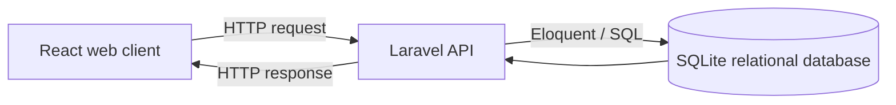

<div align="center">

> [!IMPORTANT]
> DahonMD is a screening and research system, not laboratory confirmation. Model confidence is not the biological probability that a plant has a disease.

---

## 📖 About the Project

A user captures or chooses a leaf photo, and the Android application runs the bundled model locally to classify exactly one of four conditions:

| Condition            | Description                            |
| -------------------- | -------------------------------------- |
| 🟢 Healthy           | No visible disease symptoms            |
| 🟡 Sigatoka          | Black- and Yellow-source presentations |
| 🔴 Panama disease    | Fusarium wilt symptoms                 |
| 🟠 Cordana leaf spot | Fungal leaf spotting                   |

The classification path does not upload the image, call an API, or require an account. Results are also written to an app-private SQLite history; signed-in farmer records synchronize to the shared Laravel SQL store when connectivity returns. Images remain local unless the farmer explicitly opts into research upload.

### The Platform

| Component               | Stack                                        | Purpose                                                                         |
| ----------------------- | -------------------------------------------- | ------------------------------------------------------------------------------- |
| 📱 Mobile application   | Expo / React Native + native TFLite + SQLite | **Active thesis client:** offline classification with local-first history |
| 🌐 Web application      | React / Vite                                 | Legacy/demo client; outside thesis production scope                             |
| ⚙️ Backend API        | Laravel + Eloquent + SQLite                  | Legacy/demo server and relational store; outside thesis production scope        |
| 🤖 AI research pipeline | Python / TensorFlow                          | Reproducible training, evaluation, deployment                                   |

---

## Technologies Used and Deployment Status

| Area                        | Technologies used in this repository                                                                       | Role                                                                                                        |
| --------------------------- | ---------------------------------------------------------------------------------------------------------- | ----------------------------------------------------------------------------------------------------------- |
| Mobile application          | React Native 0.86, Expo SDK 57, TypeScript 6.0                                                             | Camera/gallery workflow, interface, preprocessing coordination, local history, and optional synchronization |
| Native Android inference    | Kotlin and LiteRT/TensorFlow Lite                                                                          | Loads the bundled model, verifies the float32 tensor contract, and runs inference locally on Android        |
| AI development              | Python, TensorFlow, and Keras                                                                              | Dataset preparation, model training, evaluation, knowledge distillation, and model conversion               |
| Teacher model               | ResNet-101                                                                                                 | Research/training-only teacher; never deployed to the phone                                                 |
| Baseline model              | MobileNetV3-Small                                                                                          | Plain supervised control used for the thesis comparison                                                     |
| Proposed mobile student     | Coordinate Attention–enhanced MobileNetV3-Small                                                           | Compact model intended for on-device classification                                                         |
| Emerging technologies       | Self-supervised learning, knowledge distillation, edge AI, and post-training quantization (INT8 evaluated) | Training and deployment pipeline for producing the mobile model                                             |
| Local persistence           | Expo SQLite and app-private file storage                                                                   | Offline-first diagnosis history after local inference                                                       |
| Optional connected services | Laravel 12, Eloquent, SQLite, and React/Vite                                                               | Accounts, synchronization, agricultural review, and administration; not required for classification         |
| Version control             | Git and GitHub                                                                                             | Source history and collaboration                                                                            |

> [!IMPORTANT]
> The bundled `ca_mobilenetv3_small_fp32.tflite` is the frozen PILOT-06 seed 42
> four-class model (locked-test macro-F1 **0.96645**, accuracy **0.96644**). It is
> shipped as float32 so the on-device result matches the Keras evaluation exactly,
> and the native module enforces the float32 tensor contract at load time.
> Full-integer INT8 was evaluated but is not the production format: post-training
> quantization of this checkpoint collapsed locked-test accuracy to **0.84433**
> (macro-F1 0.84813), so recovering INT8 would require quantization-aware training
> as future work. Davao field-condition and physical-device validation remain pending.

---

## ✨ Features

| Area                            | What it provides                                                                                         |
| ------------------------------- | -------------------------------------------------------------------------------------------------------- |
| 🧑‍🌾 Thesis mobile experience | Camera/gallery input, 224 × 224 RGB preparation, four-class prediction, and confidence                  |
| 📡 Field reliability            | On-device classification without Internet, backend, or account; local history does not control inference |
| 🔬 Legacy research/demo         | Optional accounts, reviews, synchronization, and content administration; not a thesis dependency         |
| 🧠 AI research                  | Controlled MobileNetV3 baseline and Coordinate Attention enhanced model on one fixed split               |

---

## 🏗️ Architecture

### Flow A — thesis classification (production)


Inference remains fully local and continues when SQLite initialization or network access fails. After a result is produced, the app separately stores it in local SQLite and, for a signed-in farmer, places metadata in a retry-safe outbox. This persistence/sync layer never substitutes a server result for on-device inference.

### Flow B — optional legacy/demo functionality



Flow B demonstrates client–server–database separation but is not required by, and must not be inserted into, Flow A. See [the architecture overview](docs/architecture/overview.md) and [the dated audit](docs/archive/audits/architecture-audit-2026-08-28.md).

---

## 📂 Repository Guide

| Path                 | Purpose                                                                  | Guide                                     |
| -------------------- | ------------------------------------------------------------------------ | ----------------------------------------- |
| `backend/`         | Legacy/demo Laravel API and relational persistence                       | [Backend README](backend/README.md)        |
| `web-frontend/`    | Legacy/demo React browser client                                         | [Web README](web-frontend/README.md)       |
| `mobile-frontend/` | Active offline classifier plus optional local-first history/account sync | [Mobile README](mobile-frontend/README.md) |
| `ai/`              | Training, evaluation, comparison, and TFLite tooling                     | [AI README](ai/README.md)                  |
| `datasets/`        | Four-class dataset and label-review workspace                            | [Dataset README](datasets/README.md)       |
| `docs/`            | Architecture, governance, experiments, and team checklists               | [Documentation](#📚-documentation)         |

---

## 🚀 Step-by-Step Setup and Running

This guide uses **Windows PowerShell**. First, open PowerShell in the main `DahonMD` folder.

> [!IMPORTANT]
> Choose only the part you need:
>
> - For the main thesis Android app, follow **Option A**.
> - For the old web demo, follow **Option B** (easiest) or **Option C** (without Docker).
> - The AI comparison service is optional and is not needed for normal classification.

> [!TIP]
> When a server command looks "stuck," it is usually running correctly. Keep that terminal open and use a new PowerShell terminal for the next service.

### Already installed? Run this next time

If you already completed the first-time setup, use only the command for the part you want to open.

#### Main Android app

Start an Android emulator in Android Studio or connect an Android phone with USB debugging enabled. From the repository root, run:

```powershell
cd mobile-frontend
npm run android
```

This command builds and installs the DahonMD Android development app, starts Metro, and opens the app on the connected device. Keep the terminal open while using the app.

> [!IMPORTANT]
> Do not open this project by scanning its QR code in Expo Go when testing classification. Expo Go contains only its precompiled native modules; DahonMD adds the custom Kotlin `DahonMDTFLite` module and LiteRT dependency. SDK 57 alignment lets the standard Expo parts load in Expo Go, but only `npm run android` (or an EAS development/production build) includes the native classifier.

After an Expo SDK upgrade or a native configuration change, rebuild the generated Android project once:

```powershell
cd mobile-frontend
npm install
npx expo prebuild --clean --platform android
npm run android
```

The clean rebuild is not needed for ordinary TypeScript or UI changes. Use `npm run android` for normal development.

#### Legacy web demo with Docker

Open Docker Desktop, then run from the main `DahonMD` folder:

```powershell
docker compose up
```

Open [http://localhost:4173](http://localhost:4173). Press `Ctrl+C` when finished, then run `docker compose down`.

#### Legacy web demo without Docker

Make sure Docker is stopped:

```powershell
docker compose down
```

Open two PowerShell terminals in the main `DahonMD` folder.

```powershell
# Terminal 1: API
cd backend
php artisan config:clear
php artisan serve --host=0.0.0.0 --port=8001
```

```powershell
# Terminal 2: web app
cd web-frontend
npm run dev -- --host 127.0.0.1 --port 4173
```

Open [http://127.0.0.1:4173](http://127.0.0.1:4173).

#### Rebundling the website and APK (shareable updates)

When new changes need to reach the rest of the team, rebuild the website bundle
and generate a fresh Android APK, then share the two outputs:

```powershell
# 1. Website static bundle
cd web-frontend
npm run build

# 2. Android release APK (signed, installable)
cd ..\mobile-frontend\android
.\gradlew.bat assembleRelease
```

Outputs:

- **Website:** `web-frontend\dist\` — serve `dist/` behind the same-origin `/api`
  proxy to Laravel on `127.0.0.1:8001` (same setup as the dev flow).
- **APK:** `mobile-frontend\android\app\build\outputs\apk\release\app-release.apk`
  — a release APK signed with the debug keystore; fine for internal testing and
  demos, not for the Play Store (version name/code live in
  `mobile-frontend\android\app\build.gradle`).

> [!NOTE]
> The Gradle `android\` project is generated by Expo. On a fresh clone, run
> `npx expo prebuild --platform android` from `mobile-frontend` once before the
> `gradlew.bat assembleRelease` step, and confirm `npm run release:status`
> reports the bundled model is present. A release Gradle build takes several
> minutes on the first run (Metro JS bundling plus native compilation for all
> four ABIs); later builds are much faster.
>
> The first build also needs the Android SDK (set `ANDROID_HOME`, normally
> `%LOCALAPPDATA%\Android\Sdk`).

#### Mobile API URL for the connected features

The sync/review features in the app need a public address so testers' phones can
talk to the backend on your computer. We use a **free Cloudflare tunnel** for
this. Each time the tunnel restarts, it gets a brand-new random address, which is
why the app must be rebuilt afterwards.

**Good news — there is a script that does everything for you.**

##### Just run this one command

Open PowerShell in the project folder, then run:

```powershell
.\refresh-tunnel.ps1
```

That's all. The script does the whole job automatically:

1. Starts the backend (if it isn't already running).
2. Starts the web demo on http://127.0.0.1:4173 (if it isn't already running; use
   `-NoWeb` to skip it).
3. Checks if the current tunnel address still works.
   - **Works fine?** It keeps the same tunnel and moves on.
   - **Broke / after a restart / after the computer rebooted?** It starts a fresh
     tunnel and copies the new address into the app's settings.
4. Checks whether the mobile app actually changed since the last successful build
   (it fingerprints `src/`, `assets/`, the native module source, `app.json`, the
   package files and `.env`):
   - **Nothing changed?** It reuses the existing APK — no rebuild, finished in
     seconds.
   - **Mobile code/config changed?** It rebuilds the app (the APK), which takes a
     few minutes. Changes to the web frontend, the backend, or this script alone
     do **not** trigger a rebuild.
5. If a phone is connected by USB (and the app was rebuilt), it installs the
   freshly built app onto the phone automatically.
6. At the end it prints a summary with the web URL, the mobile URL
   (`https://something.trycloudflare.com/api`) and the APK path.

The build fingerprint lives in `.dahonmd\mobile-build-state.json` (git-ignored).
It is only updated after a successful rebuild, so if a build ever fails the
previous APK and fingerprint are left untouched.

###### Rebuilding the APK after code changes

After editing any mobile code (`mobile-frontend\src`, `assets\`, a native
module, `app.json`, `package.json`, or `.env`), re-run the same command from the
project folder — it detects the change and rebuilds automatically:

```powershell
.\refresh-tunnel.ps1
```

This is **not** a file-watching command. It checks once, at the moment you run
it: it compares a fingerprint of your mobile files against the last successful
build, rebuilds the release APK whenever something changed, and installs it on a
connected phone. Run it again any time you finish editing and you're done — the
backend, web demo, and tunnel stay up in the background between runs.

##### Automatic rebuild on save (watch mode)

If you'd rather not re-run the command yourself, leave this watch loop open in a
terminal. It watches the files that determine the APK contents (`.env`,
`app.json`, `index.ts`, `package.json`, `package-lock.json`, `src\`, `assets\`,
`modules\`) and invokes `.\refresh-tunnel.ps1` automatically after each batch of
edits — which still only rebuilds when something really changed:

```powershell
.\watch-mobile.ps1
```

Options: `-DebounceMs 2000` waits longer between edits before rebuilding
(default 1500), and `-DryRun` only announces that a rebuild would run (useful
for testing). Press Ctrl+C to stop.

Backend and web-frontend changes are deliberately **not** watched: the APK never
contains that code — the app reaches the backend through the tunnel URL at
runtime, so backend edits take effect on the next backend reload without any
APK rebuild.

When you need the address again later, just open this same file
`mobile-frontend\.env` — it always holds the current address.

##### Other handy options

- Force a brand-new address even though the current one still works:
  ```powershell
  .\refresh-tunnel.ps1 -Restart
  ```
- Install the current app onto a connected phone right away, even if nothing was
  rebuilt:
  ```powershell
  .\refresh-tunnel.ps1 -Install
  ```
- Don't touch the phone (useful when no tester is connected):
  ```powershell
  .\refresh-tunnel.ps1 -SkipInstall
  ```
- Skip the web demo this time (backend/tunnel only):
  ```powershell
  .\refresh-tunnel.ps1 -NoWeb
  ```
- Force an APK rebuild even though no change was detected:
  ```powershell
  .\refresh-tunnel.ps1 -ForceRebuild
  ```
- Only refresh the address without rebuilding the app (saves a few minutes if you
  just want to test from your computer):
  ```powershell
  .\refresh-tunnel.ps1 -SkipBuild
  ```
- If you'd rather see the tunnel's own window with live logs, run the simple
  launcher instead:
  ```powershell
  .\start-tunnel.bat
  ```

  It opens the backend and the tunnel, and prints the new address. Copy that
  address, once you do, paste it into `mobile-frontend\.env` and rebuild the APK.

##### For the curious (what the script is doing manually)

You normally never need this — it's the same steps the script performs.

```powershell
# 1) Terminal 1: start the backend
cd backend
php artisan serve --host 127.0.0.1 --port 8001

# 2) Terminal 2: create a fresh public tunnel (HTTP/2 avoids a known
#    connection timeout some networks cause)
cloudflared tunnel --url http://127.0.0.1:8001 --protocol http2 --no-autoupdate
```

3) Copy the printed `https://<random>.trycloudflare.com` address, add `/api` to
   the end, and put it in `mobile-frontend\.env`:
   ```dotenv
   EXPO_PUBLIC_API_URL=https://<random>.trycloudflare.com/api
   ```
4) Rebuild the app:
   ```powershell
   cd mobile-frontend\android
   .\gradlew.bat :app:createBundleReleaseJsAndAssets --rerun-tasks
   .\gradlew.bat assembleRelease
   ```

   (The `--rerun-tasks` step matters: without it the new address may not make it
   into the app.)

**Keep the tunnel running** while testers use the online features. The offline
classification and history always work — they don't need the tunnel.

---

## 💻 First-Time Setup

### Option A — Main thesis Android app

Install these first:

- Git
- Node.js 22.13 or newer (includes npm; required by Expo SDK 57)
- Android Studio with an Android emulator, or an Android phone with USB debugging enabled

The complete app does not run in Expo Go because Expo Go cannot include this repository's custom Kotlin `DahonMDTFLite` module or LiteRT dependency. Use the Android development build commands below so the classifier is compiled into the installed app.

1. Open PowerShell in the main `DahonMD` folder.
2. Install the mobile dependencies:

```powershell
cd mobile-frontend
npm install
```

3. Check whether the required model is ready:

```powershell
npm run release:status
```

If the check reports a missing model, copy the final validated model to:

```text
mobile-frontend/assets/models/ca_mobilenetv3_small_fp32.tflite
```

Do not replace it with a simulated or unvalidated model.

4. Start an Android emulator or connect your Android phone.
5. Create a clean native Android project, build it, install it on the device, and start Metro:

```powershell
npx expo prebuild --clean --platform android
npm run android
```

After this first setup, use the shorter **Main Android app** instructions under “Already installed?” above.

On the first run, Gradle may take several minutes to download and compile dependencies. Wait until DahonMD opens on the emulator or phone, and keep the terminal open while developing.

The classifier does not need a `.env` file, API URL, backend server, account, LAN connection, or Internet connection.

### Option B — Legacy web demo with Docker (easiest)

This option is only for the old web/API demo. It is not required for the Android classifier.

1. Install and open Docker Desktop.
2. Open PowerShell in the main `DahonMD` folder.
3. Build and start the demo:

```powershell
docker compose up --build
```

4. Wait until both services are ready, then open [http://localhost:4173](http://localhost:4173).
5. When finished, press `Ctrl+C`, then run:

```powershell
docker compose down
```

Your local demo data is kept for the next run. Do not add `--volumes` unless you intentionally want to erase the Docker demo data.

> [!TIP]
> To choose a different seeded password, run `$env:DEV_USER_PASSWORD = "your-local-password"` before the first `docker compose up --build`.

### Option C — Legacy web demo without Docker

Use this option only if you need to run the old API and web app directly on your computer.

Install these first:

- PHP 8.2 or newer
- Composer
- Node.js (includes npm)

Do not use Option B and Option C at the same time because both use port `8001`.

#### 1. Prepare the API

Open PowerShell in the main `DahonMD` folder, then run:

```powershell
cd backend
composer install
if (-not (Test-Path .env)) { Copy-Item .env.example .env }
```

Open `backend/.env` and set these values:

```dotenv
APP_URL=http://127.0.0.1:8001
WEB_FRONTEND_ORIGINS=http://127.0.0.1:4173,http://localhost:4173,http://localhost:5173
AI_COMPARISON_URL=http://127.0.0.1:8100/compare
```

Continue in the same terminal:

```powershell
php artisan key:generate
if (-not (Test-Path database/database.sqlite)) { New-Item database/database.sqlite -ItemType File }
php artisan migrate --seed
php artisan config:clear
php artisan serve --host=0.0.0.0 --port=8001
```

Keep this terminal open. Visit [http://127.0.0.1:8001/api/health](http://127.0.0.1:8001/api/health) and check that it reports `"status": "ok"`.

#### 2. Prepare the web app

Open a second PowerShell terminal in the main `DahonMD` folder, then run:

```powershell
cd web-frontend
npm install
if (-not (Test-Path .env)) { Copy-Item .env.example .env }
npm run dev -- --host 127.0.0.1 --port 4173
```

Keep this terminal open, then visit [http://127.0.0.1:4173](http://127.0.0.1:4173).

After this first setup, use the shorter **Legacy web demo without Docker** instructions under “Already installed?” above.

### Optional — AI comparison service

This is needed only for the thesis comparison panel. It is not needed for the Android classifier or ordinary web development. Complete the Python environment setup in the [AI guide](ai/README.md), then run this command from the main `DahonMD` folder:

```powershell
.venv\Scripts\python.exe -m uvicorn ai.deployment.comparison_service:app --host 127.0.0.1 --port 8100
```

Check [http://127.0.0.1:8100/health](http://127.0.0.1:8100/health).

### Optional — GPU model training

GPU training uses WSL and Linux Python. Do not run a second trainer if one is
already active.

The current pilot uses the balanced `banana-leaf-thesis-split-2878-v1` split:
2,878 images per class, 8,056 training images, 1,728 validation images, and a
locked 1,728-image test partition. PILOT-01 through PILOT-08 are complete.
PILOT-04 completed 100 SSL epochs and 20 supervised fine-tuning epochs. Its
selected epoch is 20, with validation macro-F1 **0.65907** and validation
accuracy **0.66551**. PILOT-05 selected and froze the stronger PILOT-03 teacher
at validation macro-F1 **0.98320**. PILOT-06 knowledge distillation completed at
validation macro-F1 **0.96178** (epoch 29), exceeding PILOT-02 by **0.01228**.
PILOT-07 confirmed the student across seeds 42, 1337, and 2026 at mean
validation macro-F1 **0.96229** ± **0.00097** and froze PILOT-06 seed 42 as the
deployment checkpoint. PILOT-08 evaluated that checkpoint once on the locked
test partition, reaching macro-F1 **0.96645** and accuracy **0.96644**; no
further tuning was performed afterward.

To monitor the current epoch in a separate PowerShell window, run:

```powershell
cd "D:\Fe Anne's Repository\Banana Leaf Disease Scanner"

& ".\ai\training\monitor_training.ps1" `
    -RunDir ".\ai\artifacts\four_class\pilot_2878_v1\pilot_04_teacher_fresh_ssl_seed42"
```

The monitor shows the phase, epoch and batch numbers, epoch percentage, phase
percentage, loss, accuracy, learning rate, and available validation metrics.

#### PILOT-04 recovery reference

Do not run a resume command while a trainer is active. From PowerShell, invoke
the short helper directly to avoid shell paste-control corruption:

```powershell
wsl.exe -d Ubuntu --cd "/mnt/d/Fe Anne's Repository/Banana Leaf Disease Scanner" --exec bash ai/training/resume_pilot04.sh
```

The helper first exits without launching training when the completion marker is
present. For an incomplete run, it checks for an active trainer, validates the
synchronized native WSL dataset and fine-tuning checkpoint, verifies GPU
visibility, selects BFC, and uses `--resume-finetune`. It derives the next epoch
from the durable history and writes `training_bfc_resume.log`.

If the existing process is present but stalled and WSL no longer responds,
restart only the Ubuntu distro from PowerShell, then launch the helper:

```powershell
wsl.exe --terminate Ubuntu
wsl.exe -d Ubuntu --cd "/mnt/d/Fe Anne's Repository/Banana Leaf Disease Scanner" --exec bash ai/training/resume_pilot04.sh
```

`--terminate Ubuntu` stops every process in that WSL distro. It does not delete
the dataset, epoch history, or model checkpoints. Do not manually delete any
training artifacts.

Recovery modes:

| Existing completed artifact                                   | Selected option               | What is repeated                                   |
| ------------------------------------------------------------- | ----------------------------- | -------------------------------------------------- |
| `ssl_checkpoint_epoch_*.complete`                           | `--resume-ssl-intermediate` | Only the unfinished SSL epoch                      |
| `resnet101_ssl_pretrained.keras`                            | `--resume-ssl`              | No SSL epochs; supervised fine-tuning starts again |
| `best_teacher.keras` plus `teacher_finetune_history.json` | `--resume-finetune`         | Only the unfinished fine-tuning epoch              |
| `teacher_training.complete.json`                            | None                          | The run is already complete                        |

The guarded helper appends recovery output to `training_bfc_resume.log`.
Dataset integrity verification occurs before GPU progress appears. Do not start
another trainer during that verification.

See the [model experiment roadmap](MODEL_EXPERIMENTS.md) for every pilot command
and decision gate, or the [complete GPU guide](ai/training/GPU_TRAINING_GUIDE.md)
for troubleshooting.

---

## 👤 Legacy/Demo Development Accounts

`php artisan migrate --seed` creates one local account for each role. The default password is `DahonMD@2026` unless `DEV_USER_PASSWORD` is set.

| Email                         | Role                     |
| ----------------------------- | ------------------------ |
| `admin@dahonmd.test`        | 🔐 Administrator         |
| `reviewer@dahonmd.test`     | 🔬 Agricultural reviewer |
| `maria.santos@dahonmd.test` | 🧑‍🌾 Farmer            |

These accounts are never seeded when `APP_ENV=production`.

**Password policy.** Registration, password reset, and account-management routes enforce a strong default policy: at least 8 characters with a mix of upper/lowercase letters, numbers, and symbols, plus a HaveIBeenPwned breach check (the breach check is skipped in the `testing` environment only).

**Authentication lifetime.** The same-origin website uses a CSRF-protected `HttpOnly` Sanctum session cookie and never stores its credential in browser storage. Mobile bearer tokens remain in the operating system's secure keystore and expire: normal tokens use `SANCTUM_TOKEN_TTL_MINUTES` (default 24h), while remember-me mobile tokens use `SANCTUM_TOKEN_REMEMBER_DAYS` (default 30 days). Both clients log out automatically after an invalid or expired session.

---

## ⚙️ Configuration

| Client or service           | Variable                        | Local value                                                                   |
| --------------------------- | ------------------------------- | ----------------------------------------------------------------------------- |
| Laravel                     | `APP_URL`                     | `http://127.0.0.1:8001`                                                     |
| Laravel CORS                | `WEB_FRONTEND_ORIGINS`        | `http://127.0.0.1:4173,http://localhost:4173,http://localhost:5173`         |
| Laravel (tokens)            | `SANCTUM_TOKEN_TTL_MINUTES`   | `1440` (normal sessions)                                                    |
| Laravel (tokens)            | `SANCTUM_TOKEN_REMEMBER_DAYS` | `30` (remember-me sessions)                                                 |
| Web                         | `VITE_WEB_API_URL`            | `/api` (Vite/Nginx proxies it to Laravel)                                   |
| Thesis mobile               | None                            | Bundled model and local native runtime only                                   |
| Thesis mobile optional sync | `EXPO_PUBLIC_API_URL`         | Temporary`<tunnel>.trycloudflare.com/api`; baked into the APK at build time |
| Research comparison         | `AI_COMPARISON_URL`           | `http://127.0.0.1:8100/compare`                                             |
| Research image consent      | `RESEARCH_CONSENT_VERSION`    | `research-image-consent-v1`                                                 |

The optional comparison service is research-only. It runs both models side by side and does not save its output as a farmer diagnosis.

---

## 🧠 AI Research Summary

The active balanced-dataset pilot uses one fixed, leakage-free four-class split
with 2,878 images per class. Model selection uses validation macro-F1; the test
partition remains locked.

| Pilot    | Model                                            | Best validation result                                          | Status             |
| -------- | ------------------------------------------------ | --------------------------------------------------------------- | ------------------ |
| PILOT-01 | MobileNetV3-Small ImageNet supervised baseline   | Macro-F1**0.92204**, accuracy **0.92245**           | Complete           |
| PILOT-02 | Coordinate Attention MobileNetV3-Small, no KD    | Macro-F1**0.94950**, accuracy **0.94965**           | Complete           |
| PILOT-03 | ResNet-101 ImageNet-only teacher                 | Macro-F1**0.98320**, accuracy **0.98322**           | Complete           |
| PILOT-04 | ResNet-101 fresh SSL plus supervised fine-tuning | Macro-F1**0.65907**, accuracy **0.66551**, epoch 20 | **Complete** |
| PILOT-05 | Validation-only teacher selection                | Selected PILOT-03 ImageNet teacher                              | **Complete** |
| PILOT-06 | Coordinate Attention student with KD             | Macro-F1**0.96178**, epoch 29                             | **Complete** |
| PILOT-07 | Multi-seed confirmation (seeds 42, 1337, 2026)   | Mean macro-F1**0.96229** ± **0.00097**             | **Complete** |
| PILOT-08 | One-time locked test evaluation (seed 42)        | Test macro-F1**0.96645**, accuracy **0.96644**      | **Complete** |

> [!WARNING]
> Results from the deleted 12,670-image exploratory split are not comparable
> with this pilot. PILOT-04 trained SSL from scratch on the new training
> partition and did not reuse the previous SSL encoder.

See the [model experiment roadmap](MODEL_EXPERIMENTS.md) for the ordered pilot
commands and decision gates, and the [AI pipeline guide](ai/README.md) for
implementation details.

---

## ✅ Quality Checks

Run the checks for the component you changed.

```powershell
# Backend
cd backend
php artisan test
vendor\bin\pint --test
```

```powershell
# Web
cd web-frontend
npm run build
```

```powershell
# Mobile
cd mobile-frontend
npm test
npm run typecheck
npm run release:status
```

```powershell
# AI
.venv\Scripts\python.exe -m unittest discover -s ai\tests -v
```

---

## 🧯 Common Problems

| Problem                                                        | Resolution                                                                                                                                                                                |
| -------------------------------------------------------------- | ----------------------------------------------------------------------------------------------------------------------------------------------------------------------------------------- |
| A command is not recognized                                    | Install the missing runtime, reopen PowerShell, and verify its version.                                                                                                                   |
| `cd backend` cannot find the folder                          | Open the terminal in the main`DahonMD` repository first.                                                                                                                                |
| A server terminal appears stuck                                | That is expected; it is waiting for requests. Keep it open.                                                                                                                               |
| Port`8001` or `4173` is occupied                           | Stop the other process using that port, then restart the service.                                                                                                                         |
| The browser says`Failed to fetch`                            | Confirm the API health URL works, the browser origin appears in`WEB_FRONTEND_ORIGINS`, and Docker is not running beside native Laravel.                                                 |
| Docker and native servers are both running                     | Press`Ctrl+C` in the native server terminal or run `docker compose down`, then keep only one workflow active.                                                                         |
| The web client cannot load data                                | Confirm both the Laravel and Vite terminals are running.                                                                                                                                  |
| Mobile release status reports a missing model                  | Produce and audit the final four-class artifact, then copy it to`mobile-frontend/assets/models/ca_mobilenetv3_small_fp32.tflite`. Do not substitute a simulated model.                  |
| New APK cannot reach sync or review                            | The baked-in`EXPO_PUBLIC_API_URL` tunnel no longer resolves. Run `.\refresh-tunnel.ps1` — it starts a fresh tunnel, updates the address, and rebuilds the APK automatically.         |
| Expo Go opens but classification is unavailable                | This is expected because Expo Go does not contain`DahonMDTFLite`. Start an emulator or connect a USB-debugging device, then run `cd mobile-frontend` followed by `npm run android`. |
| Android reports that no device or emulator is available        | Start an emulator from Android Studio's Device Manager or connect an Android phone with USB debugging enabled, then rerun`npm run android`.                                             |
| Android fails after an Expo SDK or native configuration update | From`mobile-frontend`, run `npm install`, `npx expo prebuild --clean --platform android`, and then `npm run android`.                                                             |

---

## 🧬 Scientific Boundaries

- The historical `dead` label means visibly dried or necrotic tissue, not Moko disease; it is quarantined and excluded from the production four-class model.
- `sigatoka` combines Black- and Yellow-source presentations; the model does not claim to distinguish the subtypes.
- Panama disease leaf symptoms require expert/provenance support and do not replace field or laboratory confirmation.
- Original predictions, model versions, uncertainty flags, and reviewer decisions remain separate for auditability.
- Disease guidance requires traceable evidence and agricultural review. Chemical directions are withheld unless current Philippine regulatory evidence supports them.
- The `healthy` class is not proof that a plant is disease-free.

---

## 📚 Documentation

| Document                                                                           | Purpose                                                                 |
| ---------------------------------------------------------------------------------- | ----------------------------------------------------------------------- |
| [System architecture](docs/architecture/overview.md)                                | Components, boundaries, and data flow                                   |
| [Engineering quality attributes](docs/architecture/quality-attributes.md)           | Maintainability, tests, security boundaries, and concurrent module work |
| [Scientific content governance](docs/research/scientific-content-governance.md)     | Evidence, review, and regulatory rules                                  |
| [Dataset/model checklist](docs/research/dataset-model-trainer-checklist.md)         | Required experiment gates and evidence                                  |
| [Backend consolidation](docs/archive/historical-documents/backend-consolidation.md) | Historical record of the backend architecture                           |

---

<div align="center">
