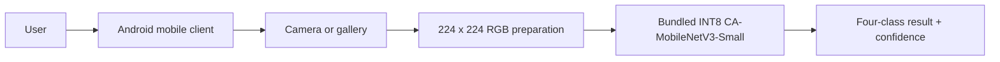
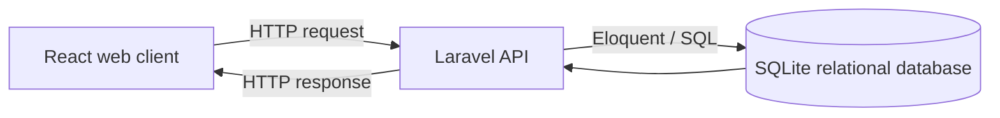

<div align="center">

#  DahonMD

**Stateless On-Device Banana Leaf Classification System**

A thesis mobile application that classifies supported banana leaf conditions locally, plus archived web/backend research utilities.

**Course:** CCE 106L – Applications Development and Emerging Technologies

**Group Members:**
| Member | Role |
| --- | --- |
| Fe Anne Malasarte | Student |
| Jay Mark Burlado | Student |
| Joevan Capote | Student |
| John Benedict Bongcac | Student |


</div>

> [!IMPORTANT]
> DahonMD is a screening and research system, not laboratory confirmation. Model confidence is not the biological probability that a plant has a disease.

---

## 📖 About the Project

A user captures or chooses a leaf photo, and the Android application runs the bundled INT8 model locally to classify exactly one of four conditions:

| Condition | Description |
| --- | --- |
| 🟢 Healthy | No visible disease symptoms |
| 🟡 Sigatoka | Black- and Yellow-source presentations |
| 🔴 Panama disease | Fusarium wilt symptoms |
| 🟠 Cordana leaf spot | Fungal leaf spotting |

The production thesis path does not upload the image, call an API, require an account, or save scan history. Model confidence is displayed locally.

### The Platform

| Component | Stack | Purpose |
| --- | --- | --- |
| 📱 Mobile application | Expo / React Native + native TFLite | **Active thesis client:** stateless offline classification |
| 🌐 Web application | React / Vite | Legacy/demo client; outside thesis production scope |
| ⚙️ Backend API | Laravel + Eloquent + SQLite | Legacy/demo server and relational store; outside thesis production scope |
| 🤖 AI research pipeline | Python / TensorFlow | Reproducible training, evaluation, deployment |

---

## ✨ Features

| Area | What it provides |
| --- | --- |
| 🧑‍🌾 Thesis mobile experience | Camera/gallery input, 224 × 224 RGB preparation, four-class prediction, and confidence |
| 📡 Field reliability | Classification without Internet, backend, account, database, upload, or persistence |
| 🔬 Legacy research/demo | Optional accounts, reviews, synchronization, and content administration; not a thesis dependency |
| 🧠 AI research | Controlled MobileNetV3 baseline and Coordinate Attention enhanced model on one fixed split |

---

## 🏗️ Architecture

### Flow A — thesis classification (production)



This flow is fully local and stateless. The mobile production entry point does not use the legacy SQLite, authentication, HTTP, synchronization, or comparison modules.

### Flow B — optional legacy/demo functionality



Flow B demonstrates client–server–database separation but is not required by, and must not be inserted into, Flow A. See [the architecture document](docs/architecture.md) and [the dated audit](docs/architecture-audit-2026-08-28.md).

---

## 📂 Repository Guide

| Path | Purpose | Guide |
| --- | --- | --- |
| `backend/` | Legacy/demo Laravel API and relational persistence | [Backend README](backend/README.md) |
| `web-frontend/` | Legacy/demo React browser client | [Web README](web-frontend/README.md) |
| `mobile-frontend/` | Active stateless thesis app; unused legacy modules remain archived under `src/` | [Mobile README](mobile-frontend/README.md) |
| `ai/` | Training, evaluation, comparison, and TFLite tooling | [AI README](ai/README.md) |
| `datasets/` | Four-class dataset and label-review workspace | [Dataset README](datasets/README.md) |
| `docs/` | Architecture, governance, experiments, and team checklists | [Documentation](#📚-documentation) |

---

## 🚀 Optional Legacy/Demo Stack with Docker

This stack starts Flow B only. It is not needed to build, launch, or use the thesis classifier.

### Requirements

- 🐳 Docker Desktop
- 📦 Git

From the repository root:

```powershell
docker compose up --build
```

> [!IMPORTANT]
> Choose either Docker or native development for the API and web client. Do not run `docker compose up` and `php artisan serve` on port `8001` at the same time.

Open the web app at <http://localhost:4173>. The shared API is available at <http://localhost:8001/api>.

The Docker stack does not start Expo or the optional Python comparison service. Use the native workflow below when working on those components.

Stop the stack with:

```powershell
docker compose down
```

Docker preserves application data in the `dahonmd_backend_data` volume. Only use `docker compose down --volumes` when you intentionally want to reset Docker-managed application data.

> [!TIP]
> Set `$env:DEV_USER_PASSWORD = "your-local-password"` before the first startup to change the seeded development password.

---

## 💻 Native Development

> [!NOTE]
> This guide assumes **Windows PowerShell**. Install PHP 8.2+, Composer, Node.js, npm, and Android Studio. The thesis classifier uses a local native module and therefore does not run in Expo Go.

Stop Docker before starting the optional legacy API/web services:

```powershell
docker compose down
```

> [!TIP]
> A command that starts a server keeps running and may look "stuck." That is normal. Leave that terminal open and use a new terminal for the next component.

### 1️⃣ Start the API

For the first run, prepare the backend and create its local settings file:

```powershell
cd backend
composer install
if (-not (Test-Path .env)) { Copy-Item .env.example .env }
```

Open `backend/.env` and confirm that it contains:

```dotenv
APP_URL=http://127.0.0.1:8001
WEB_FRONTEND_ORIGINS=http://127.0.0.1:4173,http://localhost:4173,http://localhost:5173
AI_COMPARISON_URL=http://127.0.0.1:8100/compare
```

Then continue in the same terminal:

```powershell
php artisan key:generate
if (-not (Test-Path database/database.sqlite)) { New-Item database/database.sqlite -ItemType File }
php artisan migrate --seed
php artisan config:clear
php artisan serve --host=0.0.0.0 --port=8001
```

Keep this terminal open. Check <http://127.0.0.1:8001/api/health>; it should report `"status": "ok"`.

### 2️⃣ Start the optional AI comparison service

Open a second terminal from the repository root:

```powershell
.venv\Scripts\python.exe -m uvicorn ai.deployment.comparison_service:app `
  --host 127.0.0.1 `
  --port 8100
```

Check <http://127.0.0.1:8100/health>. This service is required only for the thesis comparison panel, not for ordinary API and interface development.

### 3️⃣a Start the web client

Open another terminal from the repository root:

```powershell
cd web-frontend
npm install
if (-not (Test-Path .env)) { Copy-Item .env.example .env }
npm run dev -- --host 127.0.0.1 --port 4173
```

Visit <http://127.0.0.1:4173>.

### 3️⃣b Build the thesis mobile client

Open another terminal from the repository root:

```powershell
cd mobile-frontend
npm install
npm run release:status
```

The release status remains blocked until the final validated model is copied to `assets/models/ca_mobilenetv3_small_int8.tflite`. After that artifact is present, create and run the native Android project:

```powershell
npx expo prebuild --platform android
npx expo run:android
```

No `.env`, API URL, LAN connection, backend process, or Internet connection is required for classification.

### Later runs

For the optional legacy/demo stack, run these server commands in separate terminals:

```powershell
# Terminal 1
cd backend
php artisan config:clear
php artisan serve --host=0.0.0.0 --port=8001
```

```powershell
# Optional terminal 2: thesis comparison
.venv\Scripts\python.exe -m uvicorn ai.deployment.comparison_service:app --host 127.0.0.1 --port 8100
```

```powershell
# Terminal 2 or 3: legacy web
cd web-frontend
npm run dev -- --host 127.0.0.1 --port 4173
```

The thesis mobile build remains independent of all of those processes.

```powershell
# Optional terminal: watch AI training graphs live (see the AI guide)
.venv\Scripts\python.exe -m ai.visualization.live_history `
  --output-dir ai\artifacts\source_labeled_enhanced_cpu_pilot
```

Run the live viewer beside any training command (`train_teacher`, `train_student`, `train_baseline`). It redraws the metric curves and current batch progress every few seconds and never writes to the output directory. See [Watch training live](ai/README.md#watch-training-live) in the [AI guide](ai/README.md) for details.

---

## 👤 Legacy/Demo Development Accounts

`php artisan migrate --seed` creates one local account for each role. The default password is `DahonMD@2026` unless `DEV_USER_PASSWORD` is set.

| Email | Role |
| --- | --- |
| `admin@dahonmd.test` | 🔐 Administrator |
| `reviewer@dahonmd.test` | 🔬 Agricultural reviewer |
| `maria.santos@dahonmd.test` | 🧑‍🌾 Farmer |

These accounts are never seeded when `APP_ENV=production`.

---

## ⚙️ Configuration

| Client or service | Variable | Local value |
| --- | --- | --- |
| Laravel | `APP_URL` | `http://127.0.0.1:8001` |
| Laravel CORS | `WEB_FRONTEND_ORIGINS` | `http://127.0.0.1:4173,http://localhost:4173,http://localhost:5173` |
| Web | `VITE_WEB_API_URL` | `/api` (Vite/Nginx proxies it to Laravel) |
| Thesis mobile | None | Bundled model and local native runtime only |
| Research comparison | `AI_COMPARISON_URL` | `http://127.0.0.1:8100/compare` |
| Research image consent | `RESEARCH_CONSENT_VERSION` | `research-image-consent-v1` |

The optional comparison service is research-only. It runs both models side by side and does not save its output as a farmer diagnosis.

---

## 🧠 AI Research Summary

The AI pipeline trains and evaluates two models on one fixed, leakage-free four-class split:

| Model | Description |
| --- | --- |
| MobileNetV3-Small baseline | Plain supervised control model |
| CA-MobileNetV3-Small (proposed) | Coordinate Attention–enhanced model distilled from a self-supervised ResNet-101 teacher |

> [!WARNING]
> Earlier archived artifacts output separate Black and Yellow Sigatoka classes and have no Panama disease output. They are rejected by the current runtime and must be retrained after the new Panama candidates complete expert review. The historical `dead` label is quarantined and excluded from the four-class thesis model.

See the [AI pipeline guide](ai/README.md) for reproducible training and evaluation commands.

---

## ✅ Quality Checks

Run the checks for the component you changed.

```powershell
# Backend
cd backend
php artisan test
vendor\bin\pint --test
```

```powershell
# Web
cd web-frontend
npm run build
```

```powershell
# Mobile
cd mobile-frontend
npm test
npm run typecheck
npm run release:status
```

```powershell
# AI
.venv\Scripts\python.exe -m unittest discover -s ai\tests -v
```

---

## 🧯 Common Problems

| Problem | Resolution |
| --- | --- |
| A command is not recognized | Install the missing runtime, reopen PowerShell, and verify its version. |
| `cd backend` cannot find the folder | Open the terminal in the main `DahonMD` repository first. |
| A server terminal appears stuck | That is expected; it is waiting for requests. Keep it open. |
| Port `8001` or `4173` is occupied | Stop the other process using that port, then restart the service. |
| The browser says `Failed to fetch` | Confirm the API health URL works, the browser origin appears in `WEB_FRONTEND_ORIGINS`, and Docker is not running beside native Laravel. |
| Docker and native servers are both running | Press `Ctrl+C` in the native server terminal or run `docker compose down`, then keep only one workflow active. |
| The web client cannot load data | Confirm both the Laravel and Vite terminals are running. |
| Mobile release status reports a missing model | Produce and audit the final four-class INT8 artifact, then copy it to `mobile-frontend/assets/models/ca_mobilenetv3_small_int8.tflite`. Do not substitute a simulated model. |

---

## 🧬 Scientific Boundaries

- The historical `dead` label means visibly dried or necrotic tissue, not Moko disease; it is quarantined and excluded from the production four-class model.
- `sigatoka` combines Black- and Yellow-source presentations; the model does not claim to distinguish the subtypes.
- Panama disease leaf symptoms require expert/provenance support and do not replace field or laboratory confirmation.
- Original predictions, model versions, uncertainty flags, and reviewer decisions remain separate for auditability.
- Disease guidance requires traceable evidence and agricultural review. Chemical directions are withheld unless current Philippine regulatory evidence supports them.
- The `healthy` class is not proof that a plant is disease-free.

---

## 📚 Documentation

| Document | Purpose |
| --- | --- |
| [System architecture](docs/architecture.md) | Components, boundaries, and data flow |
| [Engineering quality attributes](docs/quality-attributes.md) | Maintainability, tests, security boundaries, and concurrent module work |
| [Scientific content governance](docs/scientific-content-governance.md) | Evidence, review, and regulatory rules |
| [Dataset/model checklist](docs/dataset-model-trainer-todo.md) | Required experiment gates and evidence |
| [Backend consolidation](docs/backend-consolidation.md) | Record of the single-backend architecture |

---

<div align="center">

Built with 💚 for careful, auditable banana-leaf screening across web, mobile, and offline field workflows.

</div>
