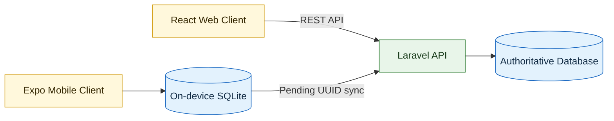

<div align="center">

# DahonMD

### Banana Leaf Disease Detection and Field Diagnosis System

One backend, one source of truth, and two clients designed for connected and offline field use.


</div>

---

## Overview

DahonMD is a monorepo for identifying banana leaf diseases, recording diagnoses, and synchronizing field observations. The React web application and Expo mobile application share one authoritative Laravel REST API, one identity system, and one central database.

The mobile application also maintains a private on-device SQLite database. This allows an authenticated farmer to view local history and save pending diagnoses when a network connection is unavailable. Pending records are synchronized to the central API when connectivity returns.

> [!IMPORTANT]
> `web-backend/` is the only runtime backend. The legacy `mobile-backend/` folder is retained as a pre-consolidation reference and must not be started during normal development.

## Highlights

- One Sanctum identity works across the web and mobile clients.
- Web and synchronized mobile diagnoses share the same central history.
- Mobile diagnoses remain available offline through on-device SQLite.
- UUID-based synchronization safely handles retries without duplicate records.
- Administrator routes provide protected farmer, disease, diagnosis, analytics, and system/model management.
- The AI workspace separates teacher training, student distillation, evaluation, and TFLite deployment tooling.

## System Architecture



The API is the source of truth for accounts, diseases, synchronized diagnoses, and administrator analytics. By default, its development database is `web-backend/database/database.sqlite`. Mobile SQLite is a device-local cache and synchronization queue, not a second server database.

## Repository Layout

| Folder | Responsibility | Runtime status |
| --- | --- | --- |
| `web-backend/` | Laravel 12 API, Sanctum authentication, central database, sync, and analytics | Authoritative |
| `web-frontend/` | React and Vite browser application | Active client |
| `mobile-frontend/` | Expo React Native application with offline SQLite | Active client |
| `mobile-backend/` | Original standalone mobile API | Deprecated |
| `ai/` | ResNet-101 teacher and Coordinate Attention MobileNetV3-Small student pipeline | Training and deployment tooling |
| `datasets/` | Local dataset location and preparation notes | Development data |
| `docs/` | Architecture and backend-consolidation documentation | Reference |

## Before You Start

This guide uses **PowerShell on Windows**. Install these tools first:

- PHP 8.2 or newer with SQLite enabled
- Composer
- Node.js and npm
- For mobile only: Expo Go on a phone, or Android Studio with an emulator

Check that the main tools are installed:

```powershell
php --version
composer --version
node --version
npm --version
```

Each command should print a version number. If PowerShell says that a command is not recognized, install that tool before continuing.

> [!IMPORTANT]
> Open every terminal in the main `Banana Leaf Disease Scanner` folder. A command such as `cd web-backend` will not work correctly if the terminal starts in a different folder.

## Choose What You Want to Run

You do not need to start every project folder.

| Goal | Terminals needed | Programs to run |
| --- | ---: | --- |
| Web app only | 2 | Laravel backend + web frontend |
| Mobile app only | 2 | Laravel backend + mobile frontend |
| Web and mobile together | 3 | Laravel backend + web frontend + mobile frontend |

The `mobile-backend` folder is old reference code. **Do not run it.** Both apps use `web-backend`.

## Run the Web App

The web app needs two terminals. Keep both terminals open while using the app.

### Web — Terminal 1: Laravel backend

For the **first run**, enter these commands one line at a time:

```powershell
cd web-backend
composer install
if (-not (Test-Path .env)) { Copy-Item .env.example .env }
php artisan key:generate
if (-not (Test-Path database/database.sqlite)) { New-Item database/database.sqlite -ItemType File }
php artisan migrate --seed
php artisan serve --host=0.0.0.0 --port=8001
```

When you see that the server is running, leave Terminal 1 open. The API is now available at `http://127.0.0.1:8001/api`.

For **later runs**, only these commands are needed:

```powershell
cd web-backend
php artisan serve --host=0.0.0.0 --port=8001
```

### Web — Terminal 2: React frontend

Open a new terminal in the main project folder. For the **first run**, enter:

```powershell
cd web-frontend
npm install
if (-not (Test-Path .env)) { Copy-Item .env.example .env }
npm run dev -- --host 127.0.0.1 --port 4173
```

Leave Terminal 2 open, then visit `http://127.0.0.1:4173` in a browser.

For **later runs**, enter:

```powershell
cd web-frontend
npm run dev -- --host 127.0.0.1 --port 4173
```

## Run the Mobile App

The mobile app also needs two terminals. It uses the same Laravel backend as the web app.

### Mobile — Terminal 1: Laravel backend

If the backend from the web instructions is already running, keep it open and skip this terminal. Otherwise, follow the first-run backend setup below:

```powershell
cd web-backend
composer install
if (-not (Test-Path .env)) { Copy-Item .env.example .env }
php artisan key:generate
if (-not (Test-Path database/database.sqlite)) { New-Item database/database.sqlite -ItemType File }
php artisan migrate --seed
php artisan serve --host=0.0.0.0 --port=8001
```

For **later runs**, enter:

```powershell
cd web-backend
php artisan serve --host=0.0.0.0 --port=8001
```

Leave Terminal 1 open. The `0.0.0.0` host is important because it allows an emulator or phone on the same network to reach the backend.

### Mobile — Terminal 2: Expo frontend

Open a new terminal in the main project folder. For the **first run**, enter:

```powershell
cd mobile-frontend
npm install
if (-not (Test-Path .env)) { Copy-Item .env.example .env }
npm start
```

For **later runs**, enter:

```powershell
cd mobile-frontend
npm start
```

Keep Terminal 2 open. Then choose one way to open the app:

- **Android emulator:** press `a` in the Expo terminal.
- **Physical Android or iPhone:** open Expo Go and scan the QR code.
- **iOS simulator:** press `i`; this option requires macOS.

### Connect a Physical Phone to the Backend

The default mobile setting works with an Android emulator. A physical phone needs the computer's local network address instead.

1. Connect the phone and computer to the same Wi-Fi network.
2. In PowerShell, run `ipconfig` and find the computer's **IPv4 Address**, such as `192.168.1.10`.
3. Open `mobile-frontend/.env` and change the API line to use that address:

   ```dotenv
   EXPO_PUBLIC_API_URL=http://192.168.1.10:8001/api
   ```

4. Replace `192.168.1.10` with the actual IPv4 address from your computer.
5. Stop Expo with `Ctrl+C`, run `npm start` again, and rescan the QR code.

> [!TIP]
> The setup commands create a local `.env` file only when one does not exist. They will not overwrite your current settings.

## Test Accounts

The first-run command `php artisan migrate --seed` creates demonstration accounts. All seeded users use the password `DahonMD@2026`.

| Email | Role |
| --- | --- |
| `admin@dahonmd.test` | Administrator |
| `maria.santos@dahonmd.test` | Farmer |
| `juan.delacruz@dahonmd.test` | Farmer |
| `liza.mercado@dahonmd.test` | Farmer |
| `ramon.bautista@dahonmd.test` | Farmer |
| `elena.villanueva@dahonmd.test` | Farmer |
| `daniel.flores@dahonmd.test` | Farmer |

These accounts are for local development only. Change `DEV_USER_PASSWORD` in `web-backend/.env` before reseeding if your group wants a different test password. They are never seeded when `APP_ENV=production`.

## Stop the Apps

Click each running terminal and press `Ctrl+C`. Closing a frontend terminal does not automatically stop the backend terminal.

## Common Terminal Problems

| Problem | What to do |
| --- | --- |
| `php`, `composer`, `node`, or `npm` is not recognized | Install the missing tool, close PowerShell, and open a new terminal. |
| `cd web-backend` says the path does not exist | Reopen the terminal in the main `Banana Leaf Disease Scanner` folder. |
| The terminal looks stuck after starting a server | This is normal. The server is waiting for requests. Leave it open and use a new terminal for the next program. |
| Port `8001` or `4173` is already in use | Another copy may already be running. Find its terminal and press `Ctrl+C`, then start it again. |
| The web page opens but cannot load data | Confirm that both the Laravel backend and React frontend terminals are still running. |
| A phone cannot connect to the API | Confirm that both devices use the same Wi-Fi, the phone's `.env` URL contains the computer's IPv4 address, and the Laravel server uses `--host=0.0.0.0`. |
| Expo does not use a changed `.env` value | Stop Expo with `Ctrl+C`, run `npm start` again, and reopen the app. |

## Client API Configuration

| Client | Environment variable | Development value |
| --- | --- | --- |
| Web browser | `VITE_WEB_API_URL` | `http://127.0.0.1:8001/api` |
| Android emulator | `EXPO_PUBLIC_API_URL` | `http://10.0.2.2:8001/api` |
| Physical phone | `EXPO_PUBLIC_API_URL` | `http://<computer-lan-ip>:8001/api` |

The Laravel server must use `--host=0.0.0.0` for access from another device. The phone and development computer must also be connected to the same local network.

## Shared Data Flow

1. A farmer signs in through either client using the same email and password.
2. Web diagnoses are stored directly through the central API.
3. Mobile diagnoses are first written to the farmer's device-local SQLite history.
4. The mobile client sends pending records to `POST /api/mobile/sync` when online.
5. The server uses each diagnosis UUID as an idempotency key.
6. A local record is marked as synchronized only after the API returns `created` or `already_synchronized`.

This flow prevents retry-related duplicates while keeping field diagnosis available during unreliable connectivity.

## Main API Routes

| Method and route | Purpose | Authentication |
| --- | --- | --- |
| `GET /api/health` | API health check | Public |
| `POST /api/auth/register` | Create an account | Public |
| `POST /api/auth/login` | Issue a Sanctum token | Public |
| `GET /api/diseases` | Read the disease catalog | Public |
| `GET, POST /api/diagnoses` | List or create diagnoses | Farmer |
| `POST /api/inference` | Submit an inference request | Farmer |
| `POST /api/mobile/sync` | Synchronize queued mobile diagnoses | Farmer |
| `/api/admin/*` | Manage users, diseases, diagnoses, and analytics | Administrator |

## Development Checks

Run the checks for the part your group changed. Start each block in a new terminal opened at the main project folder.

### Backend checks

```powershell
cd web-backend
php artisan test
vendor\bin\pint --test
```

### Web frontend check

```powershell
cd web-frontend
npm run build
```

### Mobile frontend check

```powershell
cd mobile-frontend
npx tsc --noEmit
```

## AI Pipeline

```text
Banana leaf dataset
  -> ResNet-101 self-supervised pretraining
  -> five-class supervised teacher
  -> logit and feature distillation
  -> Coordinate Attention MobileNetV3-Small student
  -> full INT8 TensorFlow Lite conversion
  -> mobile inference adapter
```

The ResNet-101 teacher is used only during offline training. It is never packaged into either client. The mobile application is designed to receive only the optimized student model; its current inference service is an adapter that can be replaced by the final TFLite bridge without changing screen code.

## Documentation

- [System architecture](docs/architecture.md)
- [Backend consolidation record](docs/backend-consolidation.md)
- [AI pipeline guide](ai/README.md)
- [Web backend guide](web-backend/README.md)
- [Mobile frontend guide](mobile-frontend/README.md)

## Scientific Content Governance

Disease content is not hard-coded from AI-generated text. The authoritative API reads the exact model classes from a five-entry `label_map.json` supplied through `AI_LABEL_MAP_PATH`; until that artifact exists and passes structural validation, the system reports **DISEASE CONTENT PENDING — final dataset class labels have not yet been established** and does not seed disease records.

Content follows a controlled lifecycle: `DRAFT` → `RESEARCHED` → `VERIFIED` → `ARCHIVED`. Only `VERIFIED` records are returned by the farmer disease API. Editing verified disease content or a supporting source automatically returns affected content to `RESEARCHED` for another review. Normal farmers cannot access knowledge or source mutation routes.

Scientific facts and farmer recommendations must be supported by claim-level evidence. Peer-reviewed and authoritative agricultural sources are prioritized, with Philippine evidence preferred whenever available. A disease cannot be verified without at least two peer-reviewed sources, one authoritative institutional source, causal-agent and curative-status mappings, and mappings for any symptom or management content. Missing evidence is represented as “Insufficient verified evidence available,” never guessed.

Chemical guidance is not inferred from academic efficacy studies. It is marked separately as requiring regulatory review and is withheld from farmer responses unless its Philippine regulatory check is current. Administrators see `REGULATORY RE-CHECK REQUIRED` when a time-sensitive check is missing or stale. Exact product directions must come from the current FPA-approved label or a licensed agricultural professional; the system does not invent doses, intervals, application methods, re-entry intervals, or pre-harvest intervals.

The classifier is a screening aid, not laboratory confirmation. Model confidence measures the strength of a match to learned class patterns and is not the biological probability that a plant has a disease. The healthy class must not be presented as proof that a plant is disease-free. Image results cannot perform PCR, culture, isolation, or molecular diagnosis. Simulated records are explicitly flagged and remain distinct from later research-deployment records.

### Source database schema

- `diseases`: model class key, accepted/common/scientific names, causal agent, pathogen type, farmer summary, curative status, evidence level, review dates, verification state, verifier, image-only limitations, and referral guidance.
- `disease_symptoms`: disease, stage, plant part, technical and farmer text, leaf-image visibility, and display order.
- `disease_management`: category, technical and farmer recommendation, evidence strength, professional/referral flag, regulatory-review flag/date, and display order.
- `research_sources`: APA-ready authorship and publication fields, DOI/URL, source type, geography, peer-review and Philippine flags, access date, and notes.
- `disease_evidence`: disease/source mapping at claim level, claim type/text, evidence strength, and disagreement/context notes.
- `pesticide_regulatory_checks`: separate product/crop/target registration status, expiry, FPA/regulatory source, approved-label URL, reviewer, and check date linked to a chemical management claim.
- `diagnoses`: immutable original prediction, confidence, model version, inference time, diagnosis date, source, simulation flag, and separate optional expert-review fields.

The finalized AI architecture remains unchanged: ResNet-101 teacher with BYOL, NT-Xent contrastive learning and masked image modeling; five-class fine-tuning; and a custom Coordinate Attention MobileNetV3-Small student distilled and deployed as INT8 TensorFlow Lite.

---

<div align="center">

Built for dependable banana disease monitoring across web, mobile, and offline field workflows.

</div>
