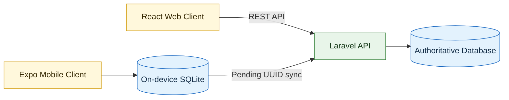

<div align="center">

# BananaCare

### Banana Leaf Disease Detection and Field Diagnosis System

One backend, one source of truth, and two clients designed for connected and offline field use.


</div>

---

## Overview

BananaCare is a monorepo for identifying banana leaf diseases, recording diagnoses, and synchronizing field observations. The React web application and Expo mobile application share one authoritative Laravel REST API, one identity system, and one central database.

The mobile application also maintains a private on-device SQLite database. This allows an authenticated user to view local history and save pending diagnoses when a network connection is unavailable. Pending records are synchronized to the central API when connectivity returns.

> [!IMPORTANT]
> `web-backend/` is the only runtime backend. The legacy `mobile-backend/` folder is retained as a pre-consolidation reference and must not be started during normal development.

## Highlights

- One Sanctum identity works across the web and mobile clients.
- Web and synchronized mobile diagnoses share the same central history.
- Mobile diagnoses remain available offline through on-device SQLite.
- UUID-based synchronization safely handles retries without duplicate records.
- Administrator routes provide protected user, disease, diagnosis, and analytics management.
- The AI workspace separates teacher training, student distillation, evaluation, and TFLite deployment tooling.

## System Architecture



The API is the source of truth for accounts, diseases, synchronized diagnoses, and administrator analytics. By default, its development database is `web-backend/database/database.sqlite`. Mobile SQLite is a device-local cache and synchronization queue, not a second server database.

## Repository Layout

| Folder | Responsibility | Runtime status |
| --- | --- | --- |
| `web-backend/` | Laravel 12 API, Sanctum authentication, central database, sync, and analytics | Authoritative |
| `web-frontend/` | React and Vite browser application | Active client |
| `mobile-frontend/` | Expo React Native application with offline SQLite | Active client |
| `mobile-backend/` | Original standalone mobile API | Deprecated |
| `ai/` | ResNet-101 teacher and Coordinate Attention MobileNetV3-Small student pipeline | Training and deployment tooling |
| `datasets/` | Local dataset location and preparation notes | Development data |
| `docs/` | Architecture and backend-consolidation documentation | Reference |

## Prerequisites

Install the following before starting the system:

- PHP 8.2 or newer with SQLite support
- Composer
- Node.js and npm
- Expo Go, Android Studio, or another supported Expo development target

## Quick Start

Open three terminals from the repository root.

### 1. Start the central backend

```powershell
cd web-backend
composer install
if (-not (Test-Path .env)) { Copy-Item .env.example .env }
php artisan key:generate
if (-not (Test-Path database/database.sqlite)) { New-Item database/database.sqlite -ItemType File }
php artisan migrate --seed
php artisan serve --host=0.0.0.0 --port=8001
```

The API will be available at `http://127.0.0.1:8001/api`.

### 2. Start the web frontend

```powershell
cd web-frontend
npm install
if (-not (Test-Path .env)) { Copy-Item .env.example .env }
npm run dev -- --host 127.0.0.1 --port 4173
```

Open `http://127.0.0.1:4173` in a browser.

### 3. Start the mobile frontend

```powershell
cd mobile-frontend
npm install
if (-not (Test-Path .env)) { Copy-Item .env.example .env }
npm start
```

Use the Expo terminal options to open Android, iOS, or Expo Go.

> [!TIP]
> The copy commands create local `.env` files. If a file already exists and contains settings you need, keep it and update only the relevant API URL.

## Client API Configuration

| Client | Environment variable | Development value |
| --- | --- | --- |
| Web browser | `VITE_WEB_API_URL` | `http://127.0.0.1:8001/api` |
| Android emulator | `EXPO_PUBLIC_API_URL` | `http://10.0.2.2:8001/api` |
| Physical phone | `EXPO_PUBLIC_API_URL` | `http://<computer-lan-ip>:8001/api` |

The Laravel server must use `--host=0.0.0.0` for access from another device. The phone and development computer must also be connected to the same local network.

## Shared Data Flow

1. A user signs in through either client using the same email and password.
2. Web diagnoses are stored directly through the central API.
3. Mobile diagnoses are first written to the user's device-local SQLite history.
4. The mobile client sends pending records to `POST /api/mobile/sync` when online.
5. The server uses each diagnosis UUID as an idempotency key.
6. A local record is marked as synchronized only after the API returns `created` or `already_synchronized`.

This flow prevents retry-related duplicates while keeping field diagnosis available during unreliable connectivity.

## Main API Routes

| Method and route | Purpose | Authentication |
| --- | --- | --- |
| `GET /api/health` | API health check | Public |
| `POST /api/auth/register` | Create an account | Public |
| `POST /api/auth/login` | Issue a Sanctum token | Public |
| `GET /api/diseases` | Read the disease catalog | Public |
| `GET, POST /api/diagnoses` | List or create diagnoses | User |
| `POST /api/inference` | Submit an inference request | User |
| `POST /api/mobile/sync` | Synchronize queued mobile diagnoses | User |
| `/api/admin/*` | Manage users, diseases, diagnoses, and analytics | Administrator |

## Development Checks

Run these checks before submitting a change:

```powershell
# Laravel tests and formatting
cd web-backend
php artisan test
vendor\bin\pint --test

# Web production build
cd ..\web-frontend
npm run build

# Mobile TypeScript check
cd ..\mobile-frontend
npx tsc --noEmit
```

## AI Pipeline

```text
Banana leaf dataset
  -> ResNet-101 self-supervised pretraining
  -> five-class supervised teacher
  -> logit and feature distillation
  -> Coordinate Attention MobileNetV3-Small student
  -> full INT8 TensorFlow Lite conversion
  -> mobile inference adapter
```

The ResNet-101 teacher is used only during offline training. It is never packaged into either client. The mobile application is designed to receive only the optimized student model; its current inference service is an adapter that can be replaced by the final TFLite bridge without changing screen code.

## Documentation

- [System architecture](docs/architecture.md)
- [Backend consolidation record](docs/backend-consolidation.md)
- [AI pipeline guide](ai/README.md)
- [Web backend guide](web-backend/README.md)
- [Mobile frontend guide](mobile-frontend/README.md)

---

<div align="center">

Built for dependable banana disease monitoring across web, mobile, and offline field workflows.

</div>
