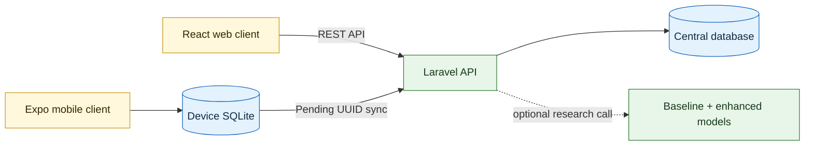

<div align="center">

# 🍌 DahonMD

**Banana Leaf Screening and Field Diagnosis System**

An end-to-end platform that helps farmers identify supported banana leaf diseases through image-based analysis.

**Course:** CCE 106L – Applications Development and Emerging Technologies

**Group Members:**
| Member | Role |
| --- | --- |
| Fe Anne Malasarte | Student |
| Jay Mark Burlado | Student |
| Joevan Capote | Student |
| John Benedict Bongcac | Student |


</div>

> [!IMPORTANT]
> DahonMD is a screening and research system, not laboratory confirmation. Model confidence is not the biological probability that a plant has a disease.

---

## 📖 About the Project

A farmer captures or uploads a leaf photo, and the system runs it through a machine learning model that classifies it into one of five conditions:

| Condition | Description |
| --- | --- |
| 🟢 Healthy | No visible disease symptoms |
| 🟡 Sigatoka | Black- and Yellow-source presentations |
| 🟠 Cordana leaf spot | Fungal leaf spotting |
| 🔴 Panama disease | Fusarium wilt symptoms |
| ⚫ Dead / necrotic | Visibly dried or dead tissue |

The result is presented as a plain-language guide with evidence-based management information and the option to request an agricultural review.

### The Platform

| Component | Stack | Purpose |
| --- | --- | --- |
| 📱 Mobile application | Expo / React Native | Offline field history + retry-safe sync |
| 🌐 Web application | React / Vite | Farmers, reviewers, and administrators |
| ⚙️ Backend API | Laravel | Serves all clients + central database |
| 🤖 AI research pipeline | Python / TensorFlow | Reproducible training, evaluation, deployment |

---

## ✨ Features

| Area | What it provides |
| --- | --- |
| 🧑‍🌾 Farmer experience | Camera/gallery scans, plain-language results, disease guide, history, and review requests |
| 📡 Field reliability | Per-farmer offline SQLite history and retry-safe synchronization |
| 🔬 Agricultural review | Prioritized queues, structured assessments, field-inspection flags, and content verification |
| 🛠️ Administration | User management, disease content, analytics, system settings, and model comparison |
| 🧠 AI research | Controlled MobileNetV3 baseline and Coordinate Attention enhanced model on one fixed split |

---

## 🏗️ Architecture



The Laravel application in `backend/` is the only runtime backend. Mobile SQLite is a private device cache and synchronization queue — it is not a second server database.

### 🔄 Shared Data Flow

1. A farmer signs in through either client using the same account.
2. Web diagnoses are saved directly through the central API.
3. Mobile diagnoses are saved first to the farmer's private on-device history.
4. Pending mobile records are sent to `POST /api/mobile/sync` when connectivity returns.
5. Diagnosis UUIDs make retries idempotent and prevent duplicate server records.
6. Agricultural reviews are stored separately and never overwrite the original model output.
7. Farmer photos enter the research-candidate queue only after explicit, versioned consent, image upload, agricultural review, and a separate expert nomination.

---

## 📂 Repository Guide

| Path | Purpose | Guide |
| --- | --- | --- |
| `backend/` | Laravel REST API, authentication, central data, reviews, and analytics | [Backend README](backend/README.md) |
| `web-frontend/` | React/Vite browser client | [Web README](web-frontend/README.md) |
| `mobile-frontend/` | Expo app with offline SQLite and synchronization | [Mobile README](mobile-frontend/README.md) |
| `ai/` | Training, evaluation, comparison, and TFLite tooling | [AI README](ai/README.md) |
| `datasets/` | Five-class dataset and label-review workspace | [Dataset README](datasets/README.md) |
| `docs/` | Architecture, governance, experiments, and team checklists | [Documentation](#📚-documentation) |

---

## 🚀 Quick Start with Docker

### Requirements

- 🐳 Docker Desktop
- 📦 Git

From the repository root:

```powershell
docker compose up --build
```

> [!IMPORTANT]
> Choose either Docker or native development for the API and web client. Do not run `docker compose up` and `php artisan serve` on port `8001` at the same time.

Open the web app at <http://localhost:4173>. The shared API is available at <http://localhost:8001/api>.

The Docker stack does not start Expo or the optional Python comparison service. Use the native workflow below when working on those components.

Stop the stack with:

```powershell
docker compose down
```

Docker preserves application data in the `dahonmd_backend_data` volume. Only use `docker compose down --volumes` when you intentionally want to reset Docker-managed application data.

> [!TIP]
> Set `$env:DEV_USER_PASSWORD = "your-local-password"` before the first startup to change the seeded development password.

---

## 💻 Native Development

> [!NOTE]
> This guide assumes **Windows PowerShell**. Install PHP 8.2+, Composer, Node.js, and npm. Expo Go or Android Studio is also required for mobile development.

Stop Docker before starting the native services:

```powershell
docker compose down
```

> [!TIP]
> A command that starts a server keeps running and may look "stuck." That is normal. Leave that terminal open and use a new terminal for the next component.

### 1️⃣ Start the API

For the first run, prepare the backend and create its local settings file:

```powershell
cd backend
composer install
if (-not (Test-Path .env)) { Copy-Item .env.example .env }
```

Open `backend/.env` and confirm that it contains:

```dotenv
APP_URL=http://127.0.0.1:8001
WEB_FRONTEND_ORIGINS=http://127.0.0.1:4173,http://localhost:4173,http://localhost:5173
AI_COMPARISON_URL=http://127.0.0.1:8100/compare
```

Then continue in the same terminal:

```powershell
php artisan key:generate
if (-not (Test-Path database/database.sqlite)) { New-Item database/database.sqlite -ItemType File }
php artisan migrate --seed
php artisan config:clear
php artisan serve --host=0.0.0.0 --port=8001
```

Keep this terminal open. Check <http://127.0.0.1:8001/api/health>; it should report `"status": "ok"`.

### 2️⃣ Start the optional AI comparison service

Open a second terminal from the repository root:

```powershell
.venv\Scripts\python.exe -m uvicorn ai.deployment.comparison_service:app `
  --host 127.0.0.1 `
  --port 8100
```

Check <http://127.0.0.1:8100/health>. This service is required only for the thesis comparison panel, not for ordinary API and interface development.

### 3️⃣a Start the web client

Open another terminal from the repository root:

```powershell
cd web-frontend
npm install
if (-not (Test-Path .env)) { Copy-Item .env.example .env }
npm run dev -- --host 127.0.0.1 --port 4173
```

Visit <http://127.0.0.1:4173>.

### 3️⃣b Start the mobile client

Open another terminal from the repository root:

```powershell
cd mobile-frontend
npm install
if (-not (Test-Path .env)) { Copy-Item .env.example .env }
npm start
```

Press `a` for an Android emulator, or scan the QR code with Expo Go. The phone and computer must use the same local network.

For a physical phone, replace the API URL in `mobile-frontend/.env` with the computer's LAN address:

```dotenv
EXPO_PUBLIC_API_URL=http://<computer-lan-ip>:8001/api
```

Replace `<computer-lan-ip>` with the IPv4 address shown by `ipconfig`, then restart Expo. If a phone cannot reach the health endpoint, allow PHP through Windows Firewall and disable the VPN or enable its local-network-access setting.

### Later runs

After the first setup, you normally need only these server commands in separate terminals:

```powershell
# Terminal 1
cd backend
php artisan config:clear
php artisan serve --host=0.0.0.0 --port=8001
```

```powershell
# Optional terminal 2: thesis comparison
.venv\Scripts\python.exe -m uvicorn ai.deployment.comparison_service:app --host 127.0.0.1 --port 8100
```

```powershell
# Terminal 2 or 3: choose web or mobile
cd web-frontend
npm run dev -- --host 127.0.0.1 --port 4173
```

```powershell
# Another terminal: mobile
cd mobile-frontend
npm start
```

```powershell
# Optional terminal: watch AI training graphs live (see the AI guide)
.venv\Scripts\python.exe -m ai.visualization.live_history `
  --output-dir ai\artifacts\source_labeled_enhanced_cpu_pilot
```

Run the live viewer beside any training command (`train_teacher`, `train_student`, `train_baseline`). It redraws the metric curves and current batch progress every few seconds and never writes to the output directory. See [Watch training live](ai/README.md#watch-training-live) in the [AI guide](ai/README.md) for details.

---

## 👤 Development Accounts

`php artisan migrate --seed` creates one local account for each role. The default password is `DahonMD@2026` unless `DEV_USER_PASSWORD` is set.

| Email | Role |
| --- | --- |
| `admin@dahonmd.test` | 🔐 Administrator |
| `reviewer@dahonmd.test` | 🔬 Agricultural reviewer |
| `maria.santos@dahonmd.test` | 🧑‍🌾 Farmer |

These accounts are never seeded when `APP_ENV=production`.

---

## ⚙️ Configuration

| Client or service | Variable | Local value |
| --- | --- | --- |
| Laravel | `APP_URL` | `http://127.0.0.1:8001` |
| Laravel CORS | `WEB_FRONTEND_ORIGINS` | `http://127.0.0.1:4173,http://localhost:4173,http://localhost:5173` |
| Web | `VITE_WEB_API_URL` | `/api` (Vite/Nginx proxies it to Laravel) |
| Android emulator | `EXPO_PUBLIC_API_URL` | `http://10.0.2.2:8001/api` |
| Physical phone | `EXPO_PUBLIC_API_URL` | `http://<computer-lan-ip>:8001/api` |
| Research comparison | `AI_COMPARISON_URL` | `http://127.0.0.1:8100/compare` |
| Research image consent | `RESEARCH_CONSENT_VERSION` | `research-image-consent-v1` |

The optional comparison service is research-only. It runs both models side by side and does not save its output as a farmer diagnosis.

---

## 🧠 AI Research Summary

The AI pipeline trains and evaluates two models on one fixed, leakage-free five-class split:

| Model | Description |
| --- | --- |
| MobileNetV3-Small baseline | Plain supervised control model |
| CA-MobileNetV3-Small (proposed) | Coordinate Attention–enhanced model distilled from a self-supervised ResNet-101 teacher |

> [!WARNING]
> Earlier archived artifacts output separate Black and Yellow Sigatoka classes and have no Panama disease output. They are rejected by the current runtime and must be retrained after the new Panama candidates complete expert review. The `dead` class is also a visible condition, not Moko disease or another causal diagnosis.

See the [AI pipeline guide](ai/README.md) for reproducible training and evaluation commands.

---

## ✅ Quality Checks

Run the checks for the component you changed.

```powershell
# Backend
cd backend
php artisan test
vendor\bin\pint --test
```

```powershell
# Web
cd web-frontend
npm run build
```

```powershell
# Mobile
cd mobile-frontend
npm test
npm run typecheck
npm run release:status
```

```powershell
# AI
.venv\Scripts\python.exe -m unittest discover -s ai\tests -v
```

---

## 🧯 Common Problems

| Problem | Resolution |
| --- | --- |
| A command is not recognized | Install the missing runtime, reopen PowerShell, and verify its version. |
| `cd backend` cannot find the folder | Open the terminal in the main `DahonMD` repository first. |
| A server terminal appears stuck | That is expected; it is waiting for requests. Keep it open. |
| Port `8001` or `4173` is occupied | Stop the other process using that port, then restart the service. |
| The browser says `Failed to fetch` | Confirm the API health URL works, the browser origin appears in `WEB_FRONTEND_ORIGINS`, and Docker is not running beside native Laravel. |
| Docker and native servers are both running | Press `Ctrl+C` in the native server terminal or run `docker compose down`, then keep only one workflow active. |
| The web client cannot load data | Confirm both the Laravel and Vite terminals are running. |
| A phone cannot reach the API | Use the computer's LAN IP, the same Wi-Fi, and Laravel host `0.0.0.0`. |
| Expo ignores an `.env` change | Stop Expo, run `npm start` again, and reopen the app. |

---

## 🧬 Scientific Boundaries

- `dead` means a visibly dried or necrotic leaf. It is not evidence of Moko disease or any specific pathogen.
- `sigatoka` combines Black- and Yellow-source presentations; the model does not claim to distinguish the subtypes.
- Panama disease leaf symptoms require expert/provenance support and do not replace field or laboratory confirmation.
- Original predictions, model versions, uncertainty flags, and reviewer decisions remain separate for auditability.
- Disease guidance requires traceable evidence and agricultural review. Chemical directions are withheld unless current Philippine regulatory evidence supports them.
- The `healthy` class is not proof that a plant is disease-free.

---

## 📚 Documentation

| Document | Purpose |
| --- | --- |
| [System architecture](docs/architecture.md) | Components, boundaries, and data flow |
| [Scientific content governance](docs/scientific-content-governance.md) | Evidence, review, and regulatory rules |
| [Dataset/model checklist](docs/dataset-model-trainer-todo.md) | Required experiment gates and evidence |
| [Backend consolidation](docs/backend-consolidation.md) | Record of the single-backend architecture |

---

<div align="center">

Built with 💚 for careful, auditable banana-leaf screening across web, mobile, and offline field workflows.

</div>
