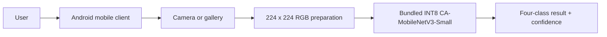
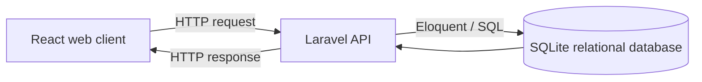

<div align="center">

#  DahonMD

**Offline-First Banana Leaf Classification System**

A thesis Android application that classifies banana leaf conditions on-device, keeps local history, and can optionally synchronize signed-in records.

**Course:** CCE 106L – Applications Development and Emerging Technologies

**Group Members:**
| Member | Role |
| --- | --- |
| Fe Anne Malasarte | Student |
| Jay Mark Burlado | Student |
| Joevan Capote | Student |
| John Benedict Bongcac | Student |


</div>

> [!IMPORTANT]
> DahonMD is a screening and research system, not laboratory confirmation. Model confidence is not the biological probability that a plant has a disease.

---

## 📖 About the Project

A user captures or chooses a leaf photo, and the Android application runs the bundled INT8 model locally to classify exactly one of four conditions:

| Condition | Description |
| --- | --- |
| 🟢 Healthy | No visible disease symptoms |
| 🟡 Sigatoka | Black- and Yellow-source presentations |
| 🔴 Panama disease | Fusarium wilt symptoms |
| 🟠 Cordana leaf spot | Fungal leaf spotting |

The classification path does not upload the image, call an API, or require an account. Results are also written to an app-private SQLite history; signed-in farmer records synchronize to the shared Laravel SQL store when connectivity returns. Images remain local unless the farmer explicitly opts into research upload.

### The Platform

| Component | Stack | Purpose |
| --- | --- | --- |
| 📱 Mobile application | Expo / React Native + native TFLite + SQLite | **Active thesis client:** offline classification with local-first history |
| 🌐 Web application | React / Vite | Legacy/demo client; outside thesis production scope |
| ⚙️ Backend API | Laravel + Eloquent + SQLite | Legacy/demo server and relational store; outside thesis production scope |
| 🤖 AI research pipeline | Python / TensorFlow | Reproducible training, evaluation, deployment |

---

## Technologies Used and Deployment Status

| Area | Technologies used in this repository | Role |
| --- | --- | --- |
| Mobile application | React Native 0.81, Expo SDK 54, TypeScript 5.9 | Camera/gallery workflow, interface, preprocessing coordination, local history, and optional synchronization |
| Native Android inference | Kotlin and LiteRT/TensorFlow Lite | Loads the bundled model, verifies the INT8 tensor contract, and runs inference locally on Android |
| AI development | Python, TensorFlow, and Keras | Dataset preparation, model training, evaluation, knowledge distillation, and model conversion |
| Teacher model | ResNet-101 | Research/training-only teacher; never deployed to the phone |
| Baseline model | MobileNetV3-Small | Plain supervised control used for the thesis comparison |
| Proposed mobile student | Coordinate Attention–enhanced MobileNetV3-Small | Compact model intended for on-device classification |
| Emerging technologies | Self-supervised learning, knowledge distillation, edge AI, and full-integer INT8 quantization | Training and deployment pipeline for producing the mobile model |
| Local persistence | Expo SQLite and app-private file storage | Offline-first diagnosis history after local inference |
| Optional connected services | Laravel 12, Eloquent, SQLite, and React/Vite | Accounts, synchronization, agricultural review, and administration; not required for classification |
| Version control | Git and GitHub | Source history and collaboration |

> [!IMPORTANT]
> The architectures and conversion/runtime checks are implemented in source,
> but the final trained `ca_mobilenetv3_small_int8.tflite` asset is not yet
> bundled. On-device inference therefore remains pending experimental and
> physical-device validation.

---

## ✨ Features

| Area | What it provides |
| --- | --- |
| 🧑‍🌾 Thesis mobile experience | Camera/gallery input, 224 × 224 RGB preparation, four-class prediction, and confidence |
| 📡 Field reliability | On-device classification without Internet, backend, or account; local history does not control inference |
| 🔬 Legacy research/demo | Optional accounts, reviews, synchronization, and content administration; not a thesis dependency |
| 🧠 AI research | Controlled MobileNetV3 baseline and Coordinate Attention enhanced model on one fixed split |

---

## 🏗️ Architecture

### Flow A — thesis classification (production)



Inference remains fully local and continues when SQLite initialization or network access fails. After a result is produced, the app separately stores it in local SQLite and, for a signed-in farmer, places metadata in a retry-safe outbox. This persistence/sync layer never substitutes a server result for on-device inference.

### Flow B — optional legacy/demo functionality



Flow B demonstrates client–server–database separation but is not required by, and must not be inserted into, Flow A. See [the architecture overview](docs/architecture/overview.md) and [the dated audit](docs/archive/audits/architecture-audit-2026-08-28.md).

---

## 📂 Repository Guide

| Path | Purpose | Guide |
| --- | --- | --- |
| `backend/` | Legacy/demo Laravel API and relational persistence | [Backend README](backend/README.md) |
| `web-frontend/` | Legacy/demo React browser client | [Web README](web-frontend/README.md) |
| `mobile-frontend/` | Active offline classifier plus optional local-first history/account sync | [Mobile README](mobile-frontend/README.md) |
| `ai/` | Training, evaluation, comparison, and TFLite tooling | [AI README](ai/README.md) |
| `datasets/` | Four-class dataset and label-review workspace | [Dataset README](datasets/README.md) |
| `docs/` | Architecture, governance, experiments, and team checklists | [Documentation](#📚-documentation) |

---

## 🚀 Step-by-Step Setup and Running

This guide uses **Windows PowerShell**. First, open PowerShell in the main `DahonMD` folder.

> [!IMPORTANT]
> Choose only the part you need:
>
> - For the main thesis Android app, follow **Option A**.
> - For the old web demo, follow **Option B** (easiest) or **Option C** (without Docker).
> - The AI comparison service is optional and is not needed for normal classification.

> [!TIP]
> When a server command looks "stuck," it is usually running correctly. Keep that terminal open and use a new PowerShell terminal for the next service.

### Already installed? Run this next time

If you already completed the first-time setup, use only the command for the part you want to open.

#### Main Android app

Start an Android emulator in Android Studio or connect an Android phone with USB debugging enabled. Then run:

```powershell
cd mobile-frontend
npx expo run:android
```

#### Legacy web demo with Docker

Open Docker Desktop, then run from the main `DahonMD` folder:

```powershell
docker compose up
```

Open <http://localhost:4173>. Press `Ctrl+C` when finished, then run `docker compose down`.

#### Legacy web demo without Docker

Make sure Docker is stopped:

```powershell
docker compose down
```

Open two PowerShell terminals in the main `DahonMD` folder.

```powershell
# Terminal 1: API
cd backend
php artisan config:clear
php artisan serve --host=0.0.0.0 --port=8001
```

```powershell
# Terminal 2: web app
cd web-frontend
npm run dev -- --host 127.0.0.1 --port 4173
```

Open <http://127.0.0.1:4173>.

---

## 💻 First-Time Setup

### Option A — Main thesis Android app

Install these first:

- Git
- Node.js (includes npm)
- Android Studio with an Android emulator, or an Android phone with USB debugging enabled

The app uses a native TFLite module, so it does not run in Expo Go.

1. Open PowerShell in the main `DahonMD` folder.
2. Install the mobile dependencies:

```powershell
cd mobile-frontend
npm install
```

3. Check whether the required model is ready:

```powershell
npm run release:status
```

If the check reports a missing model, copy the final validated model to:

```text
mobile-frontend/assets/models/ca_mobilenetv3_small_int8.tflite
```

Do not replace it with a simulated or unvalidated model.

4. Start an Android emulator or connect your Android phone.
5. Create the native Android project and run the app:

```powershell
npx expo prebuild --platform android
npx expo run:android
```

After this first setup, use the shorter **Main Android app** instructions under “Already installed?” above.

The classifier does not need a `.env` file, API URL, backend server, account, LAN connection, or Internet connection.

### Option B — Legacy web demo with Docker (easiest)

This option is only for the old web/API demo. It is not required for the Android classifier.

1. Install and open Docker Desktop.
2. Open PowerShell in the main `DahonMD` folder.
3. Build and start the demo:

```powershell
docker compose up --build
```

4. Wait until both services are ready, then open <http://localhost:4173>.
5. When finished, press `Ctrl+C`, then run:

```powershell
docker compose down
```

Your local demo data is kept for the next run. Do not add `--volumes` unless you intentionally want to erase the Docker demo data.

> [!TIP]
> To choose a different seeded password, run `$env:DEV_USER_PASSWORD = "your-local-password"` before the first `docker compose up --build`.

### Option C — Legacy web demo without Docker

Use this option only if you need to run the old API and web app directly on your computer.

Install these first:

- PHP 8.2 or newer
- Composer
- Node.js (includes npm)

Do not use Option B and Option C at the same time because both use port `8001`.

#### 1. Prepare the API

Open PowerShell in the main `DahonMD` folder, then run:

```powershell
cd backend
composer install
if (-not (Test-Path .env)) { Copy-Item .env.example .env }
```

Open `backend/.env` and set these values:

```dotenv
APP_URL=http://127.0.0.1:8001
WEB_FRONTEND_ORIGINS=http://127.0.0.1:4173,http://localhost:4173,http://localhost:5173
AI_COMPARISON_URL=http://127.0.0.1:8100/compare
```

Continue in the same terminal:

```powershell
php artisan key:generate
if (-not (Test-Path database/database.sqlite)) { New-Item database/database.sqlite -ItemType File }
php artisan migrate --seed
php artisan config:clear
php artisan serve --host=0.0.0.0 --port=8001
```

Keep this terminal open. Visit <http://127.0.0.1:8001/api/health> and check that it reports `"status": "ok"`.

#### 2. Prepare the web app

Open a second PowerShell terminal in the main `DahonMD` folder, then run:

```powershell
cd web-frontend
npm install
if (-not (Test-Path .env)) { Copy-Item .env.example .env }
npm run dev -- --host 127.0.0.1 --port 4173
```

Keep this terminal open, then visit <http://127.0.0.1:4173>.

After this first setup, use the shorter **Legacy web demo without Docker** instructions under “Already installed?” above.

### Optional — AI comparison service

This is needed only for the thesis comparison panel. It is not needed for the Android classifier or ordinary web development. Complete the Python environment setup in the [AI guide](ai/README.md), then run this command from the main `DahonMD` folder:

```powershell
.venv\Scripts\python.exe -m uvicorn ai.deployment.comparison_service:app --host 127.0.0.1 --port 8100
```

Check <http://127.0.0.1:8100/health>.

### Optional — GPU model training

GPU training uses WSL and Linux Python. Do not run a second trainer if one is
already active.

Open WSL from PowerShell:

```powershell
wsl
```

In WSL, start or resume the recommended enhanced supervised run:

```bash
cd "/mnt/c/Users/Admin/Documents/Project Fe/DahonMD"

pgrep -af 'ai[.]training[.]train_enhanced_supervised'

RUN_DIR="ai/artifacts/four_class/enhanced/diagnostics/supervised_imagenet_seed42"
mkdir -p "$RUN_DIR"

bash ai/training/run_enhanced_supervised_gpu.sh \
  > >(tee -a "$RUN_DIR/training.out.log") \
  2> >(tee -a "$RUN_DIR/training.err.log" >&2)
```

The process check must show no existing trainer before you launch. The command
automatically starts a new run or resumes the latest completed epoch and shows
a live percentage in WSL. It trains without the weak teacher and compares its
best validation macro-F1 with the 0.91231 baseline target.

To monitor the current epoch in a separate PowerShell window, run:

```powershell
cd "C:\Users\Admin\Documents\Project Fe\DahonMD"

& ".\ai\training\monitor_training.ps1" `
  -RunDir ".\ai\artifacts\four_class\enhanced\diagnostics\supervised_imagenet_seed42"
```

The monitor shows the phase, epoch and batch numbers, epoch percentage, phase
percentage, loss, accuracy, learning rate, and available validation metrics.
See the [enhanced model runbook](ai/training/ENHANCED_MODEL_RUNBOOK.md) for the
copy-paste commands or the [complete GPU guide](ai/training/GPU_TRAINING_GUIDE.md)
for teacher diagnostics and troubleshooting.

---

## 👤 Legacy/Demo Development Accounts

`php artisan migrate --seed` creates one local account for each role. The default password is `DahonMD@2026` unless `DEV_USER_PASSWORD` is set.

| Email | Role |
| --- | --- |
| `admin@dahonmd.test` | 🔐 Administrator |
| `reviewer@dahonmd.test` | 🔬 Agricultural reviewer |
| `maria.santos@dahonmd.test` | 🧑‍🌾 Farmer |

These accounts are never seeded when `APP_ENV=production`.

**Password policy.** Registration, password reset, and account-management routes enforce a strong default policy: at least 8 characters with a mix of upper/lowercase letters, numbers, and symbols, plus a HaveIBeenPwned breach check (the breach check is skipped in the `testing` environment only).

**Authentication lifetime.** The same-origin website uses a CSRF-protected `HttpOnly` Sanctum session cookie and never stores its credential in browser storage. Mobile bearer tokens remain in the operating system's secure keystore and expire: normal tokens use `SANCTUM_TOKEN_TTL_MINUTES` (default 24h), while remember-me mobile tokens use `SANCTUM_TOKEN_REMEMBER_DAYS` (default 30 days). Both clients log out automatically after an invalid or expired session.

---

## ⚙️ Configuration

| Client or service | Variable | Local value |
| --- | --- | --- |
| Laravel | `APP_URL` | `http://127.0.0.1:8001` |
| Laravel CORS | `WEB_FRONTEND_ORIGINS` | `http://127.0.0.1:4173,http://localhost:4173,http://localhost:5173` |
| Laravel (tokens) | `SANCTUM_TOKEN_TTL_MINUTES` | `1440` (normal sessions) |
| Laravel (tokens) | `SANCTUM_TOKEN_REMEMBER_DAYS` | `30` (remember-me sessions) |
| Web | `VITE_WEB_API_URL` | `/api` (Vite/Nginx proxies it to Laravel) |
| Thesis mobile | None | Bundled model and local native runtime only |
| Research comparison | `AI_COMPARISON_URL` | `http://127.0.0.1:8100/compare` |
| Research image consent | `RESEARCH_CONSENT_VERSION` | `research-image-consent-v1` |

The optional comparison service is research-only. It runs both models side by side and does not save its output as a farmer diagnosis.

---

## 🧠 AI Research Summary

The AI pipeline trains and evaluates two models on one fixed, leakage-free four-class split:

| Model | Description |
| --- | --- |
| ResNet-101 teacher | Self-supervised pretraining followed by supervised fine-tuning |
| MobileNetV3-Small baseline | Plain supervised control model |
| CA-MobileNetV3-Small (proposed) | Coordinate Attention–enhanced model; supervised recovery first, then KD only from a teacher that beats the baseline |

> [!WARNING]
> Earlier archived artifacts output separate Black and Yellow Sigatoka classes and have no Panama disease output. They are rejected by the current runtime and must be retrained after the new Panama candidates complete expert review. The historical `dead` label is quarantined and excluded from the four-class thesis model.

See the [model experiment roadmap](MODEL_EXPERIMENTS.md) for the numbered tests
and the [AI pipeline guide](ai/README.md) for implementation details.

---

## ✅ Quality Checks

Run the checks for the component you changed.

```powershell
# Backend
cd backend
php artisan test
vendor\bin\pint --test
```

```powershell
# Web
cd web-frontend
npm run build
```

```powershell
# Mobile
cd mobile-frontend
npm test
npm run typecheck
npm run release:status
```

```powershell
# AI
.venv\Scripts\python.exe -m unittest discover -s ai\tests -v
```

---

## 🧯 Common Problems

| Problem | Resolution |
| --- | --- |
| A command is not recognized | Install the missing runtime, reopen PowerShell, and verify its version. |
| `cd backend` cannot find the folder | Open the terminal in the main `DahonMD` repository first. |
| A server terminal appears stuck | That is expected; it is waiting for requests. Keep it open. |
| Port `8001` or `4173` is occupied | Stop the other process using that port, then restart the service. |
| The browser says `Failed to fetch` | Confirm the API health URL works, the browser origin appears in `WEB_FRONTEND_ORIGINS`, and Docker is not running beside native Laravel. |
| Docker and native servers are both running | Press `Ctrl+C` in the native server terminal or run `docker compose down`, then keep only one workflow active. |
| The web client cannot load data | Confirm both the Laravel and Vite terminals are running. |
| Mobile release status reports a missing model | Produce and audit the final four-class INT8 artifact, then copy it to `mobile-frontend/assets/models/ca_mobilenetv3_small_int8.tflite`. Do not substitute a simulated model. |

---

## 🧬 Scientific Boundaries

- The historical `dead` label means visibly dried or necrotic tissue, not Moko disease; it is quarantined and excluded from the production four-class model.
- `sigatoka` combines Black- and Yellow-source presentations; the model does not claim to distinguish the subtypes.
- Panama disease leaf symptoms require expert/provenance support and do not replace field or laboratory confirmation.
- Original predictions, model versions, uncertainty flags, and reviewer decisions remain separate for auditability.
- Disease guidance requires traceable evidence and agricultural review. Chemical directions are withheld unless current Philippine regulatory evidence supports them.
- The `healthy` class is not proof that a plant is disease-free.

---

## 📚 Documentation

| Document | Purpose |
| --- | --- |
| [System architecture](docs/architecture/overview.md) | Components, boundaries, and data flow |
| [Engineering quality attributes](docs/architecture/quality-attributes.md) | Maintainability, tests, security boundaries, and concurrent module work |
| [Scientific content governance](docs/research/scientific-content-governance.md) | Evidence, review, and regulatory rules |
| [Dataset/model checklist](docs/research/dataset-model-trainer-checklist.md) | Required experiment gates and evidence |
| [Backend consolidation](docs/archive/historical-documents/backend-consolidation.md) | Historical record of the backend architecture |

---

<div align="center">

Built with 💚 for careful, auditable banana-leaf screening across web, mobile, and offline field workflows.

</div>
