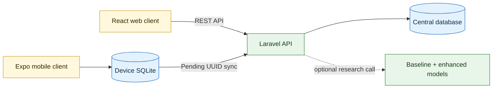

<div align="center">

# DahonMD

### Banana Leaf Screening and Field Diagnosis System

A shared Laravel API with web and mobile clients, offline field history, agricultural review, and a reproducible five-class AI research pipeline.


</div>

> [!IMPORTANT]
> DahonMD is a screening and research system, not laboratory confirmation. Model confidence is not the biological probability that a plant has a disease.

## New Student? Begin Here

You do not need to understand the whole repository before running it. Follow the path that matches your assignment:

| If you are working on... | Read this first | Your usual command |
| --- | --- | --- |
| A quick web + API preview | This README | `docker compose up --build` |
| AI training and accuracy | [AI student guide](ai/README.md) | `.venv\Scripts\python.exe ...` |
| Dataset preparation | [Dataset guide](datasets/README.md) | `ai.data.validate_dataset` |
| Laravel or database work | [Backend guide](backend/README.md) | `php artisan serve` |
| Browser interface | [Web guide](web-frontend/README.md) | `npm run dev` |
| Android or iOS app | [Mobile guide](mobile-frontend/README.md) | `npm start` |

For the easiest web and API preview, use Docker. For the mobile app or local AI comparison service, use the native-development workflow.

## Next Time You Open the Project

After Docker and the project dependencies have already been downloaded, open PowerShell in the main `DahonMD` folder and run:

```powershell
docker compose up
```

Then open:

```text
http://127.0.0.1:4173
```

Keep the PowerShell window open while using DahonMD. When you are finished, press `Ctrl+C`, then run:

```powershell
docker compose down
```

Use `docker compose up --build` instead when source code, dependencies, environment defaults, or Docker files have changed.

> [!IMPORTANT]
> Do not also run `php artisan serve` or `npm run dev` while using this Docker workflow. They can compete for ports `8001` and `4173`.

## At a Glance

| Area | What it provides |
| --- | --- |
| Farmer experience | Camera/gallery scans, plain-language results, disease guide, history, and review requests |
| Field reliability | Per-farmer offline SQLite history and retry-safe synchronization |
| Agricultural review | Prioritized queues, structured assessments, field-inspection flags, and content verification |
| Administration | User management, disease content, analytics, system settings, and model comparison |
| AI research | Controlled MobileNetV3 baseline and Coordinate Attention enhanced model on one fixed split |

## Contents

- [New student? Begin here](#new-student-begin-here)
- [Next time you open the project](#next-time-you-open-the-project)
- [Current research result](#current-research-result)
- [Architecture](#architecture)
- [Repository guide](#repository-guide)
- [Quick start with Docker](#quick-start-with-docker)
- [Native development](#native-development)
- [Development accounts](#development-accounts)
- [Configuration](#configuration)
- [Quality checks](#quality-checks)
- [Documentation](#documentation)

## Current Research Result

Both models were evaluated on the same untouched 69-image test partition.

| Model | Test accuracy | Macro F1 | Correct predictions |
| --- | ---: | ---: | ---: |
| Standard MobileNetV3-Small baseline | 91.30% | 90.40% | 63 / 69 |
| Enhanced Coordinate Attention MobileNetV3-Small | **95.65%** | **96.05%** | **66 / 69** |

The enhanced model currently leads by **4.35 percentage points in accuracy** and **5.65 percentage points in macro F1**. This is an exploratory result, not a production claim: the test set is small, and Yellow Sigatoka has only three test images from one source group pending expert label confirmation.

See the [AI pipeline guide](ai/README.md) for reproducible training and evaluation commands.

## Architecture



The Laravel application in `backend/` is the only runtime backend. Mobile SQLite is a private device cache and synchronization queue; it is not a second server database.

## Repository Guide

| Path | Purpose | Guide |
| --- | --- | --- |
| `backend/` | Laravel REST API, authentication, central data, reviews, and analytics | [Backend README](backend/README.md) |
| `web-frontend/` | React/Vite browser client | [Web README](web-frontend/README.md) |
| `mobile-frontend/` | Expo app with offline SQLite and synchronization | [Mobile README](mobile-frontend/README.md) |
| `ai/` | Training, evaluation, comparison, and TFLite tooling | [AI README](ai/README.md) |
| `datasets/` | Five-class dataset and label-review workspace | [Dataset README](datasets/README.md) |
| `docs/` | Architecture, governance, experiments, and team checklists | [Documentation](#documentation) |

## Quick Start with Docker

### Requirements

- Docker Desktop
- Git

From the repository root:

```powershell
docker compose up --build
```

> [!IMPORTANT]
> Choose either Docker or native development for the API and web client. Do not run `docker compose up` and `php artisan serve` on port `8001` at the same time.

Open the web app at <http://localhost:4173>. The shared API is available at <http://localhost:8001/api>.

You know it worked when the Docker terminal shows both services running and the DahonMD sign-in page opens in your browser.

The Docker stack does not start Expo or the optional Python comparison service. Use the native workflow below when working on those components.

Stop the stack with:

```powershell
docker compose down
```

Docker preserves application data in the `dahonmd_backend_data` volume. Only use `docker compose down --volumes` when you intentionally want to reset Docker-managed application data.

> [!TIP]
> Set `$env:DEV_USER_PASSWORD = "your-local-password"` before the first startup to change the seeded development password.

## Native Development

This guide assumes Windows PowerShell. Install PHP 8.2+, Composer, Node.js, and npm. Expo Go or Android Studio is also required for mobile development.

Stop Docker before starting the native services:

```powershell
docker compose down
```

> [!TIP]
> A command that starts a server keeps running and may look “stuck.” That is normal. Leave that terminal open and use a new terminal for the next component.

### 1. Start the API

For the first run, prepare the backend and create its local settings file:

```powershell
cd backend
composer install
if (-not (Test-Path .env)) { Copy-Item .env.example .env }
```

Open `backend/.env` and confirm that it contains:

```dotenv
APP_URL=http://127.0.0.1:8001
WEB_FRONTEND_ORIGINS=http://127.0.0.1:4173,http://localhost:4173,http://localhost:5173
AI_COMPARISON_URL=http://127.0.0.1:8100/compare
```

Then continue in the same terminal:

```powershell
php artisan key:generate
if (-not (Test-Path database/database.sqlite)) { New-Item database/database.sqlite -ItemType File }
php artisan migrate --seed
php artisan config:clear
php artisan serve --host=0.0.0.0 --port=8001
```

Keep this terminal open. Check <http://127.0.0.1:8001/api/health>; it should report `"status": "ok"`.

### 2. Start the optional AI comparison service

Open a second terminal from the repository root:

```powershell
.venv\Scripts\python.exe -m uvicorn ai.deployment.comparison_service:app `
  --host 127.0.0.1 `
  --port 8100
```

Check <http://127.0.0.1:8100/health>. This service is required only for the thesis comparison panel, not for ordinary API and interface development.

### 3A. Start the web client

Open another terminal from the repository root:

```powershell
cd web-frontend
npm install
if (-not (Test-Path .env)) { Copy-Item .env.example .env }
npm run dev -- --host 127.0.0.1 --port 4173
```

Visit <http://127.0.0.1:4173>.

### 3B. Start the mobile client

Open another terminal from the repository root:

```powershell
cd mobile-frontend
npm install
if (-not (Test-Path .env)) { Copy-Item .env.example .env }
npm start
```

Press `a` for an Android emulator, or scan the QR code with Expo Go. The phone and computer must use the same local network.

For a physical phone, replace the API URL in `mobile-frontend/.env` with the computer's LAN address:

```dotenv
EXPO_PUBLIC_API_URL=http://<computer-lan-ip>:8001/api
```

Replace `<computer-lan-ip>` with the IPv4 address shown by `ipconfig`, then restart Expo. If a phone cannot reach the health endpoint, allow PHP through Windows Firewall and disable the VPN or enable its local-network-access setting.

### Later runs

After the first setup, you normally need only these server commands in separate terminals:

```powershell
# Terminal 1
cd backend
php artisan config:clear
php artisan serve --host=0.0.0.0 --port=8001
```

```powershell
# Optional terminal 2: thesis comparison
.venv\Scripts\python.exe -m uvicorn ai.deployment.comparison_service:app --host 127.0.0.1 --port 8100
```

```powershell
# Terminal 2 or 3: choose web or mobile
cd web-frontend
npm run dev -- --host 127.0.0.1 --port 4173
```

```powershell
# Another terminal: mobile
cd mobile-frontend
npm start
```

## Development Accounts

`php artisan migrate --seed` creates one local account for each role. The default password is `DahonMD@2026` unless `DEV_USER_PASSWORD` is set.

| Email | Role |
| --- | --- |
| `admin@dahonmd.test` | Administrator |
| `reviewer@dahonmd.test` | Agricultural reviewer |
| `maria.santos@dahonmd.test` | Farmer |

These accounts are never seeded when `APP_ENV=production`.

## Configuration

| Client or service | Variable | Local value |
| --- | --- | --- |
| Laravel | `APP_URL` | `http://127.0.0.1:8001` |
| Laravel CORS | `WEB_FRONTEND_ORIGINS` | `http://127.0.0.1:4173,http://localhost:4173,http://localhost:5173` |
| Web | `VITE_WEB_API_URL` | `/api` (Vite/Nginx proxies it to Laravel) |
| Android emulator | `EXPO_PUBLIC_API_URL` | `http://10.0.2.2:8001/api` |
| Physical phone | `EXPO_PUBLIC_API_URL` | `http://<computer-lan-ip>:8001/api` |
| Research comparison | `AI_COMPARISON_URL` | `http://127.0.0.1:8100/compare` |

The optional comparison service is research-only. It runs both models side by side and does not save its output as a farmer diagnosis.

## Shared Data Flow

1. A farmer signs in through either client using the same account.
2. Web diagnoses are saved directly through the central API.
3. Mobile diagnoses are saved first to the farmer's private on-device history.
4. Pending mobile records are sent to `POST /api/mobile/sync` when connectivity returns.
5. Diagnosis UUIDs make retries idempotent and prevent duplicate server records.
6. Agricultural reviews are stored separately and never overwrite the original model output.

## Quality Checks

Run the checks for the component you changed.

```powershell
# Backend
cd backend
php artisan test
vendor\bin\pint --test
```

```powershell
# Web
cd web-frontend
npm run build
```

```powershell
# Mobile
cd mobile-frontend
npm test
npm run typecheck
npm run release:status
```

```powershell
# AI
.venv\Scripts\python.exe -m unittest discover -s ai\tests -v
```

## Common Problems

| Problem | Resolution |
| --- | --- |
| A command is not recognized | Install the missing runtime, reopen PowerShell, and verify its version. |
| `cd backend` cannot find the folder | Open the terminal in the main `DahonMD` repository first. |
| A server terminal appears stuck | That is expected; it is waiting for requests. Keep it open. |
| Port `8001` or `4173` is occupied | Stop the other process using that port, then restart the service. |
| The browser says `Failed to fetch` | Confirm the API health URL works, the browser origin appears in `WEB_FRONTEND_ORIGINS`, and Docker is not running beside native Laravel. |
| Docker and native servers are both running | Press `Ctrl+C` in the native server terminal or run `docker compose down`, then keep only one workflow active. |
| The web client cannot load data | Confirm both the Laravel and Vite terminals are running. |
| A phone cannot reach the API | Use the computer's LAN IP, the same Wi-Fi, and Laravel host `0.0.0.0`. |
| Expo ignores an `.env` change | Stop Expo, run `npm start` again, and reopen the app. |

## Scientific Boundaries

- `dead` means a visibly dried or necrotic leaf. It is not evidence of Moko disease or any specific pathogen.
- Black and Yellow Sigatoka must not be assigned from lesion color alone when provenance or expert review is uncertain.
- Original predictions, model versions, uncertainty flags, and reviewer decisions remain separate for auditability.
- Disease guidance requires traceable evidence and agricultural review. Chemical directions are withheld unless current Philippine regulatory evidence supports them.
- The `healthy` class is not proof that a plant is disease-free.

## Documentation

| Document | Purpose |
| --- | --- |
| [System architecture](docs/architecture.md) | Components, boundaries, and data flow |
| [Scientific content governance](docs/scientific-content-governance.md) | Evidence, review, and regulatory rules |
| [Dataset/model checklist](docs/dataset-model-trainer-todo.md) | Required experiment gates and evidence |
| [Baseline experiment](docs/experiments/source-labeled-baseline-2026-08-14.md) | Controlled baseline results |
| [Enhanced CPU pilot](docs/experiments/source-labeled-enhanced-cpu-pilot-2026-08-15.md) | Earlier enhanced-model pilot |
| [Backend consolidation](docs/backend-consolidation.md) | Record of the single-backend architecture |

---

<div align="center">

Built for careful, auditable banana-leaf screening across web, mobile, and offline field workflows.

</div>
