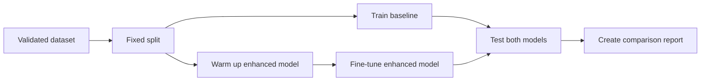

<div align="center">

# DahonMD AI Guide

### A student-friendly walkthrough for training and comparing both models

</div>

> [!IMPORTANT]
> Run every command from the main `DahonMD` folder in **PowerShell**. Do not run them from inside `ai/`.

## Start Here

Choose what you want to do:

| Goal | Go to |
| --- | --- |
| See the current accuracy | [Current result](#current-result) |
| Prepare Python for the first time | [One-time setup](#one-time-setup) |
| Train both models yourself | [Train both models](#train-both-models) |
| Read and compare the scores | [View the accuracy](#view-the-accuracy) |
| Understand the generated files | [Where are my results?](#where-are-my-results) |
| Export a phone-ready model | [Advanced: TensorFlow Lite](#advanced-tensorflow-lite) |
| Fix a training problem | [Common problems](#common-problems) |

## Current Result

Both models were tested on the same 69 held-out images.

| Model | Test accuracy | Macro F1 | Correct images |
| --- | ---: | ---: | ---: |
| Baseline MobileNetV3-Small | 91.30% | 90.40% | 63 / 69 |
| **Enhanced MobileNetV3-Small** | **95.65%** | **96.05%** | **66 / 69** |

The **enhanced model is the current winner** on this fixed test split.

> [!CAUTION]
> This is a thesis experiment, not guaranteed field accuracy. The test set is small, and Yellow Sigatoka has only three test images whose source labels still require expert confirmation.

## What Are We Comparing?

### Baseline model

The baseline is a standard MobileNetV3-Small classifier. It gives the thesis a fair reference model.

### Enhanced model

The enhanced model starts from MobileNetV3-Small, then adds:

- Coordinate Attention;
- compatible ImageNet weight transfer;
- warm-up and fine-tuning stages; and
- light knowledge distillation from a ResNet-101 teacher.

The teacher helps only during training. Farmers do not download or run the large teacher model.

### Simple training flow



## Important Words

| Term | Plain-language meaning |
| --- | --- |
| Training set | Images the model learns from |
| Validation set | Images used to choose the best checkpoint and settings |
| Test set | Untouched images used for the final reported score |
| Accuracy | Percentage of all test images classified correctly |
| Macro F1 | Average class performance, giving every class equal importance |
| Checkpoint | A saved copy of model weights |
| Epoch | One complete pass through the training data |
| Baseline | The standard model used as a reference |
| Enhanced | The proposed model being compared with the baseline |

Training accuracy is not the final thesis accuracy. Use the result printed by the **evaluation** commands.

## Before You Train

Check these items first:

- The dataset exists at `datasets/banana_leaf_5class`.
- The five class folders use the exact names listed below.
- Python dependencies are installed in `.venv`.
- The existing teacher checkpoint is available, or you plan to train it.
- You have enough time: CPU training can take hours.
- Your computer will not sleep during training.

## One-Time Setup

### 1. Create the Python environment

```powershell
python -m venv .venv
```

### 2. Install the required packages

```powershell
.venv\Scripts\python.exe -m pip install -r ai\requirements.txt
```

### 3. Create the local AI settings file

```powershell
if (-not (Test-Path ai\.env)) { Copy-Item ai\.env.example ai\.env }
```

You do not need to activate the virtual environment because every command below calls `.venv\Scripts\python.exe` directly.

## Check the Dataset

The five classes and their fixed output order are:

| Index | Folder name | Display name |
| ---: | --- | --- |
| 0 | `healthy` | Healthy |
| 1 | `dead` | Dead leaf |
| 2 | `black-sigatoka` | Black Sigatoka |
| 3 | `yellow-sigatoka` | Yellow Sigatoka |
| 4 | `cordana-leaf-spot` | Cordana leaf spot |

`dead` describes a visibly dried or necrotic leaf. It does not mean that Moko or another specific pathogen caused the condition.

Validate the files before every formal experiment:

```powershell
.venv\Scripts\python.exe -m ai.data.validate_dataset `
  --dataset-dir datasets\banana_leaf_5class
```

Do not continue if the validator reports unreadable files, wrong folders, duplicate-label conflicts, or data leakage.

## Train Both Models

Keep using the **same PowerShell window** for all steps below. The first step creates variables that later commands need.

### Step 1: Create a new experiment folder

This protects the current best model from being overwritten.

```powershell
$run = Get-Date -Format "yyyyMMdd-HHmmss"
$baselineOut = "ai/artifacts/runs/$run/baseline"
$warmupOut = "ai/artifacts/runs/$run/enhanced-warmup"
$enhancedOut = "ai/artifacts/runs/$run/enhanced"

New-Item -ItemType Directory -Force $baselineOut, $warmupOut, $enhancedOut
Copy-Item "ai/artifacts/source_labeled_baseline/split_manifest.json" "$warmupOut/split_manifest.json"
Copy-Item "ai/artifacts/source_labeled_baseline/split_manifest.json" "$enhancedOut/split_manifest.json"
```

The `$run` variable gives the experiment a unique date and time. The other variables remember where each model should be saved.

> [!NOTE]
> These instructions reuse the project's existing canonical split. This is important because both models must receive the same training, validation, and test images.

### Step 2: Train the baseline

```powershell
.venv\Scripts\python.exe -m ai.training.train_baseline `
  --dataset-dir datasets\banana_leaf_5class `
  --config ai\config\source_labeled_baseline.json `
  --output-dir $baselineOut `
  --split-manifest ai\artifacts\source_labeled_baseline\split_manifest.json
```

Wait until PowerShell prints `Best baseline saved to ...`.

### Step 3: Evaluate the baseline

```powershell
.venv\Scripts\python.exe -m ai.evaluation.evaluate_baseline `
  --dataset-dir datasets\banana_leaf_5class `
  --config ai\config\source_labeled_baseline.json `
  --output-dir $baselineOut `
  --split-manifest ai\artifacts\source_labeled_baseline\split_manifest.json `
  --baseline-model "$baselineOut/best_baseline.keras"
```

Near the end, PowerShell prints the baseline test accuracy and macro F1.

### Step 4: Check that the teacher exists

```powershell
Test-Path ai\artifacts\source_labeled_enhanced_cpu_pilot\best_teacher.keras
```

If PowerShell prints `True`, continue. If it prints `False`, follow [Train the teacher](#train-the-teacher) first.

### Step 5: Warm up the enhanced model

```powershell
.venv\Scripts\python.exe -m ai.training.train_student `
  --dataset-dir datasets\banana_leaf_5class `
  --config ai\config\source_labeled_enhanced_transfer.json `
  --output-dir $warmupOut `
  --teacher-model ai\artifacts\source_labeled_enhanced_cpu_pilot\best_teacher.keras
```

This stage transfers compatible ImageNet weights while the shared backbone is initially frozen. Wait until the best warm-up checkpoint is saved.

### Step 6: Fine-tune the enhanced model

```powershell
.venv\Scripts\python.exe -m ai.training.train_student `
  --dataset-dir datasets\banana_leaf_5class `
  --config ai\config\source_labeled_enhanced_transfer_finetune.json `
  --output-dir $enhancedOut `
  --teacher-model ai\artifacts\source_labeled_enhanced_cpu_pilot\best_teacher.keras `
  --initial-student-model "$warmupOut/best_student.keras"
```

Fine-tuning uses a small learning rate and keeps transferred Batch Normalization layers frozen for stability on the small dataset.

### Step 7: Evaluate the enhanced model

```powershell
.venv\Scripts\python.exe -m ai.evaluation.evaluate_student `
  --dataset-dir datasets\banana_leaf_5class `
  --config ai\config\source_labeled_enhanced_transfer_finetune.json `
  --output-dir $enhancedOut `
  --split-manifest ai\artifacts\source_labeled_baseline\split_manifest.json `
  --student-model "$enhancedOut/best_student.keras"
```

Near the end, PowerShell prints the enhanced test accuracy and macro F1.

### Step 8: Create the final comparison

```powershell
.venv\Scripts\python.exe -m ai.evaluation.compare_models `
  --baseline-report "$baselineOut/baseline_evaluation.json" `
  --enhanced-report "$enhancedOut/student_evaluation.json" `
  --output "$enhancedOut/model_comparison.json"
```

This command also verifies that both evaluation reports used the same labels, preprocessing, model size, and split-manifest fingerprint.

## View the Accuracy

Paste this into the **same PowerShell window** after completing training:

```powershell
$report = Get-Content "$enhancedOut/model_comparison.json" | ConvertFrom-Json

"Baseline accuracy: {0:P2}" -f $report.metrics.accuracy.baseline
"Enhanced accuracy: {0:P2}" -f $report.metrics.accuracy.enhanced
"Baseline macro F1: {0:P2}" -f $report.metrics.macro_f1.baseline
"Enhanced macro F1: {0:P2}" -f $report.metrics.macro_f1.enhanced
"Current winner: $($report.outcome.current_leader)"
```

Example output:

```text
Baseline accuracy: 91.30%
Enhanced accuracy: 95.65%
Baseline macro F1: 90.40%
Enhanced macro F1: 96.05%
Current winner: enhanced
```

Your new run may produce slightly different numbers. That is normal because model training can vary between runs.

## Where Are My Results?

All files from your run are stored below:

```text
ai/artifacts/runs/<date-and-time>/
├── baseline/
├── enhanced-warmup/
└── enhanced/
```

Important files:

| File | What it contains |
| --- | --- |
| `best_baseline.keras` | Best validation-selected baseline checkpoint |
| `best_student.keras` | Best validation-selected enhanced checkpoint |
| `baseline_evaluation.json` | Full baseline test results |
| `student_evaluation.json` | Full enhanced test results |
| `model_comparison.json` | Side-by-side scores and current winner |
| `*_confusion_matrix.png` | Image showing correct and incorrect class predictions |
| `*_history.json` | Accuracy and loss for every training epoch |
| `experiment_config.json` | Settings used for the experiment |
| `split_manifest.json` | Exact images assigned to each data split |
| `label_map.json` | Output index and class-name mapping |

## How to Interpret the Scores

Do not report accuracy alone.

| Result | What to check |
| --- | --- |
| Accuracy | Overall percentage correct |
| Macro F1 | Whether performance is balanced across classes |
| Per-class recall | How many real examples of each class were found |
| Per-class precision | How often each predicted class was correct |
| Support | Number of test images available for each class |
| Confusion matrix | Which classes are being confused |

A model can have high accuracy while performing poorly on a small class. This is why macro F1 and per-class recall are important for the thesis.

## Train the Teacher

Only do this if `best_teacher.keras` is missing or if your research plan specifically requires a new teacher run. ResNet-101 training is much slower than training the two MobileNetV3 models.

```powershell
.venv\Scripts\python.exe -m ai.training.train_teacher `
  --dataset-dir datasets\banana_leaf_5class `
  --config ai\config\source_labeled_enhanced_cpu_pilot.json
```

The expected checkpoint is:

```text
ai/artifacts/source_labeled_enhanced_cpu_pilot/best_teacher.keras
```

## Common Problems

| Problem | What to do |
| --- | --- |
| `python` is not recognized | Install Python, reopen PowerShell, and retry. |
| `.venv\Scripts\python.exe` is missing | Run the one-time environment creation step. |
| `No module named tensorflow` | Reinstall `ai\requirements.txt` into `.venv`. |
| A split manifest is missing | Confirm the current baseline artifacts exist and rerun dataset validation. |
| `best_teacher.keras` is missing | Follow [Train the teacher](#train-the-teacher). |
| `$baselineOut` or `$enhancedOut` is empty | Return to Step 1 in the same PowerShell window. |
| Training seems frozen | Look for CPU/GPU activity; one epoch may take several minutes. |
| The computer ran out of memory | Close other programs or lower `data.batch_size` in a copied config. |
| New accuracy is different | Small training variations are normal; keep the configuration and seed record. |
| Comparison says contracts differ | One model used different labels, preprocessing, or test images; do not compare those reports. |

## Rules for a Fair Thesis Comparison

1. Use the same dataset and `split_manifest.json` for both models.
2. Keep photographs of the same leaf or plant together in one split.
3. Choose settings and checkpoints using validation data only.
4. Do not repeatedly change the model after viewing test performance.
5. Report accuracy, macro F1, per-class scores, support, and the confusion matrix.
6. Record the seed, configuration, TensorFlow version, hardware, and dataset provenance.
7. Test genuine farmer-phone images before claiming real-world performance.
8. Treat uncertain labels as uncertain; do not force mixed Sigatoka images into one class.

One additional error changes the current 69-image test accuracy by about 1.45 percentage points. A larger and more realistic test set may raise or lower the reported score and will provide stronger evidence.

## Advanced: TensorFlow Lite

You do not need this section to compare Keras model accuracy. Use it only after training and evaluation are complete.

### Export the baseline

```powershell
.venv\Scripts\python.exe -m ai.deployment.convert_baseline_tflite `
  --dataset-dir datasets\banana_leaf_5class `
  --config ai\config\source_labeled_baseline.json `
  --output-dir $baselineOut `
  --split-manifest ai\artifacts\source_labeled_baseline\split_manifest.json `
  --baseline-model "$baselineOut/best_baseline.keras"
```

### Export the enhanced model

```powershell
.venv\Scripts\python.exe -m ai.deployment.convert_tflite `
  --dataset-dir datasets\banana_leaf_5class `
  --config ai\config\source_labeled_enhanced_transfer_finetune.json `
  --output-dir $enhancedOut `
  --student-model "$enhancedOut/best_student.keras"
```

Conversion success does not prove that an INT8 model is ready for phones. Benchmark FP32 and INT8 exports on the unchanged test split, confirm per-class recall, and measure latency on the target phone.

## Advanced: Local Comparison Service

The optional service lets the web and mobile research panels run both FP32 TFLite models on one farmer image.

Configure `ai/.env` with matching model, label-map, and comparison-report paths, then run:

```powershell
.venv\Scripts\python.exe -m uvicorn ai.deployment.comparison_service:app `
  --host 127.0.0.1 `
  --port 8100
```

Set this in `backend/.env`:

```dotenv
AI_COMPARISON_URL=http://127.0.0.1:8100/compare
```

This feature is research-only. It never saves the side-by-side output as a farmer diagnosis, and confidence on one image does not decide which model is better.

## Technical Reference

### Input contract

Every supported image follows this preprocessing path:

```text
JPG / JPEG / PNG / WEBP / BMP
        ↓
three-channel RGB
        ↓
resize to 224 × 224
        ↓
float32 values from 0 to 1
```

The network sees pixel values, not the filename extension. Compression, camera processing, lighting, blur, framing, backgrounds, devices, and disease stages can still change accuracy.

### AI folder map

| Folder | Purpose |
| --- | --- |
| `config/` | Labels and experiment settings |
| `data/` | Validation, grouping, splitting, and augmentation |
| `models/` | Teacher, baseline, and enhanced architectures |
| `losses/` | Classification and distillation objectives |
| `training/` | Commands that train each model |
| `evaluation/` | Metrics, confusion matrices, comparison, and Grad-CAM |
| `deployment/` | TFLite export, benchmarking, and inference service |
| `tests/` | AI pipeline regression tests |

For image provenance and label rules, read the [dataset guide](../datasets/README.md). For the required evidence at each stage, use the [dataset/model trainer checklist](../docs/dataset-model-trainer-todo.md).
