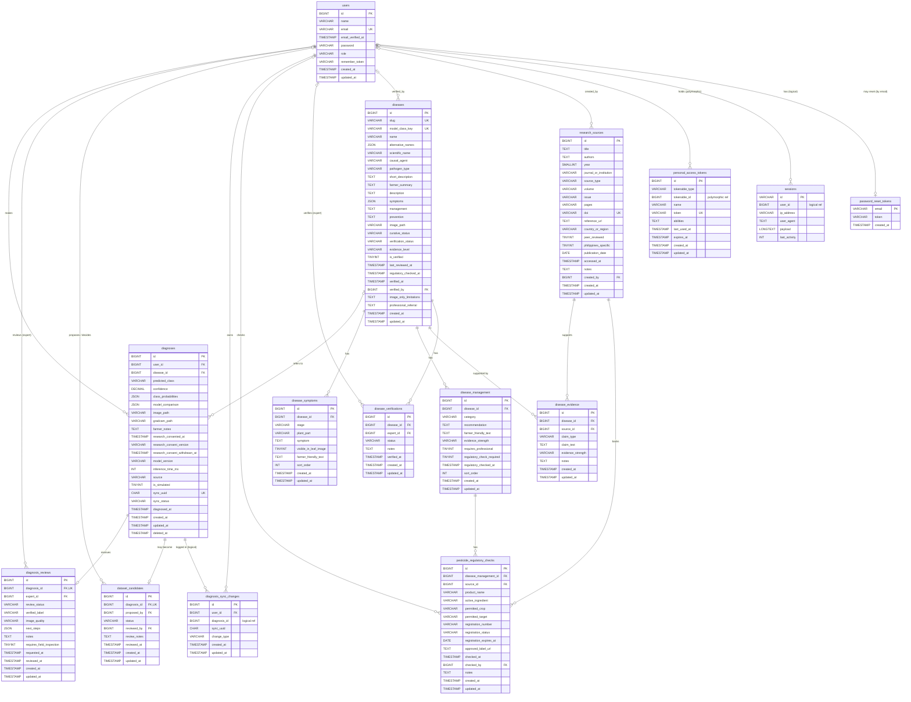
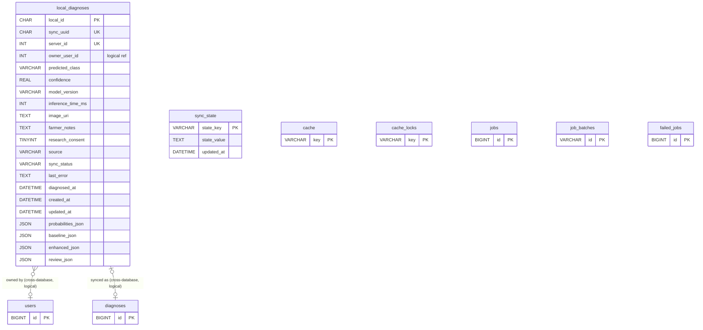

# DahonMD Database — Complete Source for the Data Dictionary and Data Model

> **For the AI assistant reading this file:** everything you need to write the
> **Data Dictionary (document)** and draw the **Data Model (diagram)** is in this
> file. It was generated from the real database: a fresh database was built from
> every migration in the project on 2026-09-29 and its structure was read back
> column by column, so the names, types, keys, nullability and defaults below are
> exact. **Do not invent, rename, merge or drop tables or fields.** Section 1
> tells you exactly what to produce.

---

## Table of contents

1. [Instructions for producing the deliverables](#1-instructions-for-producing-the-deliverables)
2. [System overview](#2-system-overview)
3. [Conventions used in this file](#3-conventions-used-in-this-file)
4. [Server database — application tables (12)](#4-server-database--application-tables)
5. [Server database — framework / security tables (8)](#5-server-database--framework--security-tables)
6. [Mobile (on-device) database — tables (2)](#6-mobile-on-device-database)
7. [Relationships and cardinality](#7-relationships-and-cardinality)
8. [Allowed values (domains) for coded fields](#8-allowed-values-domains-for-coded-fields)
9. [Normalization evidence (UNF → 1NF → 2NF → 3NF)](#9-normalization-evidence)
10. [Ready-to-use ER diagram (Mermaid)](#10-ready-to-use-er-diagram-mermaid)
11. [Drawing the diagram in Draw.io / Lucidchart / MySQL Workbench](#11-drawing-the-diagram-in-other-tools)
12. [Quick-reference counts and checklist](#12-quick-reference-counts-and-checklist)

---

## 1. Instructions for producing the deliverables

The student's instructor requires two files.

### 1.1 Deliverable A — Data Dictionary (document file)

For **each table/entity**, produce a table with exactly these columns, in this order:

| Field Name | Data Type | Field Length | Key (PK/FK) | Allow Null | Description |
|---|---|---|---|---|---|

Rules:

- **Data Type** — use the MySQL-style type given in this file (e.g. `BIGINT UNSIGNED`, `VARCHAR`, `TEXT`, `DECIMAL`, `TIMESTAMP`, `DATE`, `TINYINT`, `JSON`, `CHAR`). Keep types consistent across tables.
- **Field Length** — the number from this file (e.g. `255` for VARCHAR, `5,2` for DECIMAL, `36` for CHAR, `1` for TINYINT boolean). Write `—` when not applicable (TEXT, JSON, TIMESTAMP, DATE, INT types).
- **Key** — `PK`, `FK`, `PK, FK`, `UK` (unique) or `—`. For an FK, add the referenced table and column in the description (e.g. "FK → users.id").
- **Allow Null** — exactly `Yes` or `No`.
- **Description** — one short, plain-English sentence stating the purpose. Mention the default value and allowed values when they exist (see Section 8).
- Start each table with a one-line **table description** (given in this file).
- Include **all 20 server tables** and the **2 mobile tables**. The 8 framework/security tables (Section 5) can be placed in a separate section titled "Framework and security tables", but must not be left out.
- Keep the order used in this file. Use the table name exactly as written (lowercase with underscores).
- Add a short **front section**: purpose of the database, DBMS (SQLite in development; MySQL-compatible types), naming conventions (Section 3), and a legend for PK / FK / UK.
- Add an **appendix** listing the allowed values in Section 8, and a **relationships table** from Section 7.

### 1.2 Deliverable B — Data Model (diagram file)

The diagram must show:

- **All entities** (tables) with **all attributes** (name + type).
- **PK** and **FK** clearly marked on each attribute.
- **Relationship lines** between entities, labelled with a verb phrase.
- **Cardinality** in crow's-foot notation (1—1, 1—M, M—N), exactly as in Section 7.
- **Evidence of normalization to at least 3NF** — see Section 9. Recommended: put a small "Normalization notes" box on the diagram, and a second page showing the 3NF decomposition of the JSON fields (Section 9.4).

Suggested layout for readability:

- **Page 1 — Core model**: `users`, `diagnoses`, `diagnosis_reviews`, `dataset_candidates`, `diagnosis_sync_changes`, `diseases`, `disease_symptoms`, `disease_management`, `disease_evidence`, `research_sources`, `pesticide_regulatory_checks`, `disease_verifications`.
- **Page 2 — Framework/security tables** (`personal_access_tokens`, `password_reset_tokens`, `sessions`, `cache`, `cache_locks`, `jobs`, `job_batches`, `failed_jobs`) and **Mobile database** (`local_diagnoses`, `sync_state`), with the dashed cross-database links from Section 7.3.
- **Page 3 (optional but strongly recommended) — Normalized (3NF) logical view** from Section 9.4.

A complete Mermaid ER diagram is provided in Section 10; tools and steps are in Section 11.

---

## 2. System overview

**DahonMD** is a banana-leaf disease screening system built as a thesis project. A farmer photographs a banana leaf and an on-device AI model classifies it into one of four classes: `healthy`, `sigatoka`, `panama-disease`, `cordana-leaf-spot`.

The system has **two databases**:

| Database | Where it lives | Technology | Purpose |
|---|---|---|---|
| **Server database** | Laravel 12 backend | SQLite in development (MySQL-compatible schema through Laravel migrations) | Accounts and roles, synced diagnoses, agricultural-expert reviews, research dataset candidates, and the scientific disease knowledge base with its research sources |
| **Mobile database** | Inside the Android app on each phone (`dahonmd-offline.db`) | SQLite (Expo SQLite) | Offline-first scan history; works without internet and synchronizes with the server when a farmer is signed in |

### 2.1 User roles

| Role value | Who | Main data they create |
|---|---|---|
| `farmer` | Banana growers | `diagnoses` (scans), review requests |
| `agricultural_expert` | Qualified agricultural reviewers | `diagnosis_reviews`, `disease_verifications`, `dataset_candidates` decisions |
| `admin` | System administrators | Accounts, `diseases`, `research_sources`, `disease_evidence`, `pesticide_regulatory_checks` |

### 2.2 How the data flows

1. A farmer scans a leaf → a row is saved in the phone's `local_diagnoses`.
2. If signed in, the phone sends it to the server → one row in `diagnoses` (linked by `sync_uuid`), and one `diagnosis_sync_changes` row.
3. The farmer may request a review → a `diagnosis_reviews` row (`pending`); an agricultural expert completes it.
4. An expert may nominate the image for future research → a `dataset_candidates` row.
5. Admins maintain one `diseases` record per model class, with `disease_symptoms`, `disease_management` and `disease_evidence` (claims from `research_sources`); experts verify the content (`disease_verifications`).

---

## 3. Conventions used in this file

### 3.1 Type mapping (Laravel migration → MySQL-style type → SQLite storage)

| Laravel migration definition | Data Type to write | Field Length | Notes |
|---|---|---|---|
| `id()` | `BIGINT UNSIGNED` | — | Primary key, AUTO_INCREMENT |
| `foreignId()` | `BIGINT UNSIGNED` | — | Foreign key to another table's `id` |
| `string()` | `VARCHAR` | `255` | Unless a different length is stated |
| `string(..., 45 / 50 / 64 / 16)` | `VARCHAR` | `45` / `50` / `64` / `16` | Explicit lengths noted per field |
| `rememberToken()` | `VARCHAR` | `100` | |
| `uuid()` | `CHAR` | `36` | UUID text form |
| `text()` / `mediumText()` / `longText()` | `TEXT` / `MEDIUMTEXT` / `LONGTEXT` | — | |
| `json()` | `JSON` | — | Stored as TEXT in SQLite |
| `boolean()` | `TINYINT` | `1` | 0 = false, 1 = true |
| `decimal(5, 2)` | `DECIMAL` | `5,2` | e.g. 91.25 |
| `integer()` | `INT` | — | |
| `unsignedInteger()` | `INT UNSIGNED` | — | |
| `unsignedTinyInteger()` | `TINYINT UNSIGNED` | — | |
| `unsignedSmallInteger()` | `SMALLINT UNSIGNED` | — | |
| `timestamp()` | `TIMESTAMP` | — | |
| `date()` | `DATE` | — | |
| `timestamps()` | `created_at`, `updated_at` — `TIMESTAMP` | — | Both nullable; set automatically |
| `softDeletes()` | `deleted_at` — `TIMESTAMP` | — | Nullable; non-null means "deleted" (kept as a sync tombstone) |

### 3.2 Naming and key conventions

- Table names: plural, lowercase, `snake_case` (e.g. `diagnosis_reviews`).
- Every application table uses a surrogate primary key `id` (except `password_reset_tokens`, `sessions`, `cache`, `cache_locks`, `job_batches` and the mobile tables, which use natural/text keys — stated per table).
- Foreign keys are named `<entity>_id` or a role name (`verified_by`, `checked_by`, `proposed_by`, `reviewed_by`, `created_by`, `expert_id`) and reference `users.id` or another table's `id`.
- Referential actions: **CASCADE** = child rows are deleted with the parent; **SET NULL** = the FK becomes NULL when the parent is deleted (history is kept); **RESTRICT** = the parent cannot be deleted while children exist.
- "UK" = has a UNIQUE constraint. "IDX" = indexed for faster lookup (optional to mention).

---

## 4. Server database — application tables

### 4.1 `users`

**Description:** Registered accounts for farmers, agricultural experts and administrators.
**Primary key:** `id` · **Unique:** `email` · **Indexed:** `role`

| Field Name | Data Type | Field Length | Key | Allow Null | Default | Description |
|---|---|---|---|---|---|---|
| id | BIGINT UNSIGNED | — | PK | No | auto-increment | Unique identifier of the user. |
| name | VARCHAR | 255 | — | No | — | Full name of the user. |
| email | VARCHAR | 255 | UK | No | — | Login email address; must be unique. |
| email_verified_at | TIMESTAMP | — | — | Yes | NULL | When the email address was verified; NULL if not yet verified. |
| password | VARCHAR | 255 | — | No | — | Hashed password (bcrypt); the plain password is never stored. |
| role | VARCHAR | 255 | — (IDX) | No | `farmer` | Access role: `farmer`, `agricultural_expert` or `admin`. |
| remember_token | VARCHAR | 100 | — | Yes | NULL | Token for the "remember me" login option. |
| created_at | TIMESTAMP | — | — | Yes | NULL | When the account was created. |
| updated_at | TIMESTAMP | — | — | Yes | NULL | When the account was last updated. |

### 4.2 `diseases`

**Description:** One governed knowledge record per model class (Healthy, Sigatoka, Panama Disease, Cordana Leaf Spot) with farmer-facing and scientific content.
**Primary key:** `id` · **Unique:** `slug`, `model_class_key` · **Indexed:** `verification_status`, `is_verified`

| Field Name | Data Type | Field Length | Key | Allow Null | Default | Description |
|---|---|---|---|---|---|---|
| id | BIGINT UNSIGNED | — | PK | No | auto-increment | Unique identifier of the disease record. |
| slug | VARCHAR | 255 | UK | No | — | URL-friendly identifier (e.g. `panama-disease`). |
| model_class_key | VARCHAR | 255 | UK | Yes | NULL | AI model class label this record describes (`healthy`, `sigatoka`, `panama-disease`, `cordana-leaf-spot`). |
| name | VARCHAR | 255 | — | No | — | Accepted display name (e.g. "Panama Disease"). |
| alternative_names | JSON | — | — | Yes | NULL | List of other names for the condition (e.g. "Fusarium wilt of banana"). |
| scientific_name | VARCHAR | 255 | — | Yes | NULL | Scientific name of the pathogen. |
| causal_agent | VARCHAR | 255 | — | Yes | NULL | Organism that causes the disease. |
| pathogen_type | VARCHAR | 255 | — | Yes | NULL | Type of pathogen: `fungus`, `bacterium`, `virus` or `other`. |
| short_description | TEXT | — | — | Yes | NULL | One-line summary of the condition. |
| farmer_summary | TEXT | — | — | Yes | NULL | Plain-language explanation for farmers. |
| description | TEXT | — | — | No | — | Main description of the disease. |
| symptoms | JSON | — | — | No | — | List of farmer-friendly symptom sentences shown in the app (derived from `disease_symptoms`). |
| management | TEXT | — | — | No | — | Summary of how the disease is managed. |
| prevention | TEXT | — | — | Yes | NULL | Summary of how to prevent the disease or its spread. |
| image_path | VARCHAR | 255 | — | Yes | NULL | Storage path of the reference image. |
| curative_status | VARCHAR | 255 | — | No | `unclear_evidence` | Whether a cure exists: `curative_treatment_available`, `manageable_not_curable`, `no_known_cure`, `unclear_evidence`. |
| verification_status | VARCHAR | 255 | — (IDX) | No | `draft` | Review stage of the content (see Section 8). |
| evidence_level | VARCHAR | 255 | — | No | `limited` | Overall strength of supporting evidence: `high`, `moderate`, `limited`. |
| is_verified | TINYINT | 1 | — (IDX) | No | 0 | 1 when the content is verified and published to farmers. |
| last_reviewed_at | TIMESTAMP | — | — | Yes | NULL | When the content was last reviewed. |
| regulatory_checked_at | TIMESTAMP | — | — | Yes | NULL | When product/regulatory information was last checked. |
| verified_at | TIMESTAMP | — | — | Yes | NULL | When the content was verified. |
| verified_by | BIGINT UNSIGNED | — | FK | Yes | NULL | FK → users.id. Expert who verified the content (SET NULL on user delete). |
| image_only_limitations | TEXT | — | — | Yes | NULL | What a leaf photo cannot confirm about this condition. |
| professional_referral | TEXT | — | — | Yes | NULL | When the farmer should seek an agricultural professional. |
| created_at | TIMESTAMP | — | — | Yes | NULL | When the record was created. |
| updated_at | TIMESTAMP | — | — | Yes | NULL | When the record was last updated. |

### 4.3 `disease_symptoms`

**Description:** Individual symptoms of a disease by stage and plant part.
**Primary key:** `id`

| Field Name | Data Type | Field Length | Key | Allow Null | Default | Description |
|---|---|---|---|---|---|---|
| id | BIGINT UNSIGNED | — | PK | No | auto-increment | Unique identifier of the symptom. |
| disease_id | BIGINT UNSIGNED | — | FK | No | — | FK → diseases.id. Disease the symptom belongs to (CASCADE on delete). |
| stage | VARCHAR | 255 | — | No | — | Disease stage: `early`, `typical`, `advanced`. |
| plant_part | VARCHAR | 255 | — | No | — | Affected part: `leaves`, `pseudostem`, `roots`, `fruit`, `flower`, `suckers`. |
| symptom | TEXT | — | — | No | — | Technical description of the symptom. |
| visible_in_leaf_image | TINYINT | 1 | — | No | 0 | 1 if the symptom can be seen in a leaf photograph. |
| farmer_friendly_text | TEXT | — | — | Yes | NULL | Plain-language version of the symptom. |
| sort_order | INT UNSIGNED | — | — | No | 0 | Display order within the disease. |
| created_at | TIMESTAMP | — | — | Yes | NULL | When the symptom was added. |
| updated_at | TIMESTAMP | — | — | Yes | NULL | When the symptom was last updated. |

### 4.4 `disease_management`

**Description:** Individual management and prevention recommendations for a disease.
**Primary key:** `id` · **Indexed:** `category`

| Field Name | Data Type | Field Length | Key | Allow Null | Default | Description |
|---|---|---|---|---|---|---|
| id | BIGINT UNSIGNED | — | PK | No | auto-increment | Unique identifier of the recommendation. |
| disease_id | BIGINT UNSIGNED | — | FK | No | — | FK → diseases.id. Disease the recommendation applies to (CASCADE on delete). |
| category | VARCHAR | 255 | — (IDX) | No | — | Type of measure (see Section 8), e.g. `sanitation`, `cultural`, `expert_referral`. |
| recommendation | TEXT | — | — | No | — | Technical recommendation text. |
| farmer_friendly_text | TEXT | — | — | Yes | NULL | Plain-language version shown to farmers. |
| evidence_strength | VARCHAR | 255 | — | No | `limited` | Strength of evidence: `high`, `moderate`, `limited`. |
| requires_professional | TINYINT | 1 | — | No | 0 | 1 if the measure should involve an agricultural professional. |
| regulatory_check_required | TINYINT | 1 | — | No | 0 | 1 if the measure involves a product needing a regulatory (FPA) check. |
| regulatory_checked_at | TIMESTAMP | — | — | Yes | NULL | When the regulatory check was done. |
| sort_order | INT UNSIGNED | — | — | No | 0 | Display order within the disease. |
| created_at | TIMESTAMP | — | — | Yes | NULL | When the recommendation was added. |
| updated_at | TIMESTAMP | — | — | Yes | NULL | When the recommendation was last updated. |

### 4.5 `research_sources`

**Description:** Bibliographic records of scientific, government and regulatory sources used as evidence.
**Primary key:** `id` · **Unique:** `doi` · **Indexed:** `year`, `source_type`, `peer_reviewed`, `philippines_specific`

| Field Name | Data Type | Field Length | Key | Allow Null | Default | Description |
|---|---|---|---|---|---|---|
| id | BIGINT UNSIGNED | — | PK | No | auto-increment | Unique identifier of the source. |
| title | TEXT | — | — | No | — | Title of the publication or document. |
| authors | TEXT | — | — | No | — | Author list (semicolon-separated as written in the citation). |
| year | SMALLINT UNSIGNED | — | — (IDX) | Yes | NULL | Publication year. |
| journal_or_institution | VARCHAR | 255 | — | No | — | Journal name or issuing institution. |
| source_type | VARCHAR | 255 | — (IDX) | No | — | Kind of source (see Section 8), e.g. `peer_reviewed_article`. |
| volume | VARCHAR | 255 | — | Yes | NULL | Journal volume. |
| issue | VARCHAR | 255 | — | Yes | NULL | Journal issue. |
| pages | VARCHAR | 255 | — | Yes | NULL | Page range or article number. |
| doi | VARCHAR | 255 | UK | Yes | NULL | Digital Object Identifier; unique when present. |
| reference_url | TEXT | — | — | Yes | NULL | Web address of the source. |
| country_or_region | VARCHAR | 255 | — | Yes | NULL | Country or region the source covers. |
| peer_reviewed | TINYINT | 1 | — (IDX) | No | 0 | 1 if the source is peer reviewed. |
| philippines_specific | TINYINT | 1 | — (IDX) | No | 0 | 1 if the source is specific to the Philippines. |
| publication_date | DATE | — | — | Yes | NULL | Exact publication date, if known. |
| accessed_at | TIMESTAMP | — | — | Yes | NULL | When the source was last accessed/checked. |
| notes | TEXT | — | — | Yes | NULL | Reviewer notes about the source. |
| created_by | BIGINT UNSIGNED | — | FK | Yes | NULL | FK → users.id. Admin who added the source (SET NULL on user delete). |
| created_at | TIMESTAMP | — | — | Yes | NULL | When the source was added. |
| updated_at | TIMESTAMP | — | — | Yes | NULL | When the source was last updated. |

### 4.6 `disease_evidence`

**Description:** Associative (junction) entity linking a disease to a research source through a specific scientific claim. Resolves the **many-to-many** relationship between `diseases` and `research_sources`.
**Primary key:** `id` · **Indexed:** `claim_type`

| Field Name | Data Type | Field Length | Key | Allow Null | Default | Description |
|---|---|---|---|---|---|---|
| id | BIGINT UNSIGNED | — | PK | No | auto-increment | Unique identifier of the evidence claim. |
| disease_id | BIGINT UNSIGNED | — | FK | No | — | FK → diseases.id. Disease the claim is about (CASCADE on delete). |
| source_id | BIGINT UNSIGNED | — | FK | No | — | FK → research_sources.id. Source supporting the claim (CASCADE on delete). |
| claim_type | VARCHAR | 255 | — (IDX) | No | — | Kind of claim (see Section 8), e.g. `symptom`, `transmission`. |
| claim_text | TEXT | — | — | No | — | The claim as supported by the source. |
| evidence_strength | VARCHAR | 255 | — | No | `limited` | Strength of the claim: `high`, `moderate`, `limited`. |
| notes | TEXT | — | — | Yes | NULL | Additional notes about the claim. |
| created_at | TIMESTAMP | — | — | Yes | NULL | When the claim was recorded. |
| updated_at | TIMESTAMP | — | — | Yes | NULL | When the claim was last updated. |

### 4.7 `pesticide_regulatory_checks`

**Description:** Records of checks that a pesticide product mentioned in a management recommendation is registered with the Philippine Fertilizer and Pesticide Authority (FPA) for the crop and target.
**Primary key:** `id` · **Indexed:** `registration_status`

| Field Name | Data Type | Field Length | Key | Allow Null | Default | Description |
|---|---|---|---|---|---|---|
| id | BIGINT UNSIGNED | — | PK | No | auto-increment | Unique identifier of the regulatory check. |
| disease_management_id | BIGINT UNSIGNED | — | FK | No | — | FK → disease_management.id. Recommendation the product belongs to (CASCADE on delete). |
| source_id | BIGINT UNSIGNED | — | FK | No | — | FK → research_sources.id. Regulatory document used for the check (RESTRICT: the source cannot be deleted while used). |
| product_name | VARCHAR | 255 | — | No | — | Brand name of the product. |
| active_ingredient | VARCHAR | 255 | — | Yes | NULL | Active ingredient of the product. |
| permitted_crop | VARCHAR | 255 | — | No | — | Crop the registration allows (e.g. banana). |
| permitted_target | VARCHAR | 255 | — | No | — | Pest or disease the registration allows. |
| registration_number | VARCHAR | 255 | — | Yes | NULL | FPA registration number. |
| registration_status | VARCHAR | 255 | — (IDX) | No | — | `registered`, `restricted`, `banned`, `expired` or `unverified`. |
| registration_expires_at | DATE | — | — | Yes | NULL | When the registration expires. |
| approved_label_url | TEXT | — | — | Yes | NULL | Link to the approved product label. |
| checked_at | TIMESTAMP | — | — | No | — | When the check was performed. |
| checked_by | BIGINT UNSIGNED | — | FK | Yes | NULL | FK → users.id. Person who performed the check (SET NULL on user delete). |
| notes | TEXT | — | — | Yes | NULL | Notes about the check. |
| created_at | TIMESTAMP | — | — | Yes | NULL | When the check was recorded. |
| updated_at | TIMESTAMP | — | — | Yes | NULL | When the check was last updated. |

### 4.8 `disease_verifications`

**Description:** History of expert verification decisions on a disease record. Also resolves the **many-to-many** relationship between experts (`users`) and `diseases`.
**Primary key:** `id` · **Indexed:** `status`

| Field Name | Data Type | Field Length | Key | Allow Null | Default | Description |
|---|---|---|---|---|---|---|
| id | BIGINT UNSIGNED | — | PK | No | auto-increment | Unique identifier of the verification decision. |
| disease_id | BIGINT UNSIGNED | — | FK | No | — | FK → diseases.id. Disease record that was reviewed (CASCADE on delete). |
| expert_id | BIGINT UNSIGNED | — | FK | Yes | NULL | FK → users.id. Expert who made the decision (SET NULL on user delete). |
| status | VARCHAR | 255 | — (IDX) | No | — | Decision: `verified`, `revision_required` or `rejected`. |
| notes | TEXT | — | — | Yes | NULL | Expert's notes explaining the decision. |
| verified_at | TIMESTAMP | — | — | Yes | NULL | When the decision was made. |
| created_at | TIMESTAMP | — | — | Yes | NULL | When the decision was recorded. |
| updated_at | TIMESTAMP | — | — | Yes | NULL | When the decision was last updated. |

### 4.9 `diagnoses`

**Description:** One saved leaf scan (AI prediction) from the mobile app or website. The original prediction fields are **immutable** once saved.
**Primary key:** `id` · **Unique:** `sync_uuid` · **Indexed:** `predicted_class`, `diagnosed_at`, `is_simulated`, `deleted_at`

| Field Name | Data Type | Field Length | Key | Allow Null | Default | Description |
|---|---|---|---|---|---|---|
| id | BIGINT UNSIGNED | — | PK | No | auto-increment | Unique identifier of the diagnosis. |
| user_id | BIGINT UNSIGNED | — | FK | No | — | FK → users.id. Farmer who made the scan (CASCADE on delete). |
| disease_id | BIGINT UNSIGNED | — | FK | Yes | NULL | FK → diseases.id. Knowledge record for the predicted class (SET NULL on delete, CASCADE on update). |
| predicted_class | VARCHAR | 255 | — (IDX) | No | — | Class predicted by the AI model: `healthy`, `sigatoka`, `panama-disease`, `cordana-leaf-spot`. |
| confidence | DECIMAL | 5,2 | — | No | — | Model confidence in the predicted class, as a percentage (0.00–100.00). |
| class_probabilities | JSON | — | — | Yes | NULL | Probability (0–1) the model gave each class, e.g. `{"healthy":0.05,"sigatoka":0.88,…}`. |
| model_comparison | JSON | — | — | Yes | NULL | On-device baseline vs enhanced model results for the same photo (class, confidence, time, model). |
| image_path | VARCHAR | 255 | — | Yes | NULL | Private storage path of the leaf photo (only if the farmer consented or requested review). |
| gradcam_path | VARCHAR | 255 | — | Yes | NULL | Storage path of the model-attention (Grad-CAM) image, if generated. |
| farmer_notes | TEXT | — | — | Yes | NULL | Notes the farmer added for the reviewer. |
| research_consented_at | TIMESTAMP | — | — | Yes | NULL | When the farmer consented to research use of the image. |
| research_consent_version | VARCHAR | 50 | — | Yes | NULL | Version of the consent text the farmer agreed to. |
| research_consent_withdrawn_at | TIMESTAMP | — | — | Yes | NULL | When the farmer withdrew research consent. |
| model_version | VARCHAR | 255 | — | Yes | NULL | Identifier of the AI model that made the prediction. |
| inference_time_ms | INT UNSIGNED | — | — | Yes | NULL | Time the model took to predict, in milliseconds. |
| source | VARCHAR | 255 | — | No | `web` | Where the scan was made: `web` or `mobile`. |
| is_simulated | TINYINT | 1 | — (IDX) | No | 1 | 1 if produced by a simulated (development) model; mobile scans are always 0 (real on-device model). |
| sync_uuid | CHAR | 36 | UK | Yes | NULL | UUID generated on the phone; links this record to the phone's `local_diagnoses` row and prevents duplicates. |
| sync_status | VARCHAR | 255 | — | Yes | NULL | Server-side sync state (`synced` for mobile records; NULL for web). |
| diagnosed_at | TIMESTAMP | — | — (IDX) | No | — | When the leaf was scanned. |
| created_at | TIMESTAMP | — | — | Yes | NULL | When the record reached the server. |
| updated_at | TIMESTAMP | — | — | Yes | NULL | When the record was last updated. |
| deleted_at | TIMESTAMP | — | — (IDX) | Yes | NULL | When the farmer deleted the scan (soft delete kept so other devices learn about the deletion). |

### 4.10 `diagnosis_reviews`

**Description:** An agricultural expert's assessment of one diagnosis. At most **one review per diagnosis** (1—0..1).
**Primary key:** `id` · **Unique:** `diagnosis_id` · **Indexed:** `review_status`

| Field Name | Data Type | Field Length | Key | Allow Null | Default | Description |
|---|---|---|---|---|---|---|
| id | BIGINT UNSIGNED | — | PK | No | auto-increment | Unique identifier of the review. |
| diagnosis_id | BIGINT UNSIGNED | — | FK, UK | No | — | FK → diagnoses.id. Diagnosis being reviewed; unique (CASCADE on delete). |
| expert_id | BIGINT UNSIGNED | — | FK | Yes | NULL | FK → users.id. Expert who reviewed it (SET NULL on user delete, so completed reviews stay as audit records). |
| review_status | VARCHAR | 255 | — (IDX) | No | `pending` | Outcome (see Section 8), e.g. `pending`, `confirmed`, `alternate_class`. |
| verified_label | VARCHAR | 255 | — | Yes | NULL | Class the expert selected when the AI prediction was wrong. |
| image_quality | VARCHAR | 255 | — | Yes | NULL | Expert's rating of the photo (see Section 8). |
| next_steps | JSON | — | — | Yes | NULL | List of recommended next steps (see Section 8). |
| notes | TEXT | — | — | Yes | NULL | Expert's professional notes. |
| requires_field_inspection | TINYINT | 1 | — | No | 0 | 1 if a field or laboratory inspection is needed. |
| requested_at | TIMESTAMP | — | — | Yes | NULL | When the farmer requested the review. |
| reviewed_at | TIMESTAMP | — | — | Yes | NULL | When the expert completed the review. |
| created_at | TIMESTAMP | — | — | Yes | NULL | When the review record was created. |
| updated_at | TIMESTAMP | — | — | Yes | NULL | When the review was last updated. |

### 4.11 `dataset_candidates`

**Description:** Reviewed images nominated for a future research training dataset. Nomination does **not** add the image to training data; a separate manual decision is recorded here. At most one candidate per diagnosis.
**Primary key:** `id` · **Unique:** `diagnosis_id` · **Indexed:** `status`

| Field Name | Data Type | Field Length | Key | Allow Null | Default | Description |
|---|---|---|---|---|---|---|
| id | BIGINT UNSIGNED | — | PK | No | auto-increment | Unique identifier of the candidate. |
| diagnosis_id | BIGINT UNSIGNED | — | FK, UK | No | — | FK → diagnoses.id. Diagnosis whose image is nominated; unique (CASCADE on delete). |
| proposed_by | BIGINT UNSIGNED | — | FK | Yes | NULL | FK → users.id. Expert who nominated the image (SET NULL on user delete). |
| status | VARCHAR | 255 | — (IDX) | No | `pending` | Decision: `pending`, `approved`, `rejected`, `uncertain`. |
| reviewed_by | BIGINT UNSIGNED | — | FK | Yes | NULL | FK → users.id. Person who made the decision (SET NULL on user delete). |
| review_notes | TEXT | — | — | Yes | NULL | Reason for the decision. |
| reviewed_at | TIMESTAMP | — | — | Yes | NULL | When the decision was made. |
| created_at | TIMESTAMP | — | — | Yes | NULL | When the image was nominated. |
| updated_at | TIMESTAMP | — | — | Yes | NULL | When the candidate was last updated. |

### 4.12 `diagnosis_sync_changes`

**Description:** Append-only change log used by phones to download new, updated and deleted diagnoses since their last sync ("sync cursor").
**Primary key:** `id` · **Indexed:** `diagnosis_id`, `sync_uuid`, (`user_id`, `id`)

| Field Name | Data Type | Field Length | Key | Allow Null | Default | Description |
|---|---|---|---|---|---|---|
| id | BIGINT UNSIGNED | — | PK | No | auto-increment | Unique, increasing identifier of the change; used as the sync cursor. |
| user_id | BIGINT UNSIGNED | — | FK | No | — | FK → users.id. Owner of the changed diagnosis (CASCADE on delete). |
| diagnosis_id | BIGINT UNSIGNED | — | — (IDX) | No | — | ID of the changed diagnosis. Logical reference to diagnoses.id **without** an FK constraint, so deletion records survive after a diagnosis is removed. |
| sync_uuid | CHAR | 36 | — (IDX) | Yes | NULL | Phone-generated UUID of the changed diagnosis. |
| change_type | VARCHAR | 16 | — | No | — | `upsert` (created/updated) or `delete`. |
| created_at | TIMESTAMP | — | — | Yes | NULL | When the change happened. |
| updated_at | TIMESTAMP | — | — | Yes | NULL | When the change row was last updated. |

---

## 5. Server database — framework / security tables

These tables are created by the Laravel framework and the Sanctum authentication package. They are part of the database and must be documented, but they hold technical rather than domain data.

### 5.1 `personal_access_tokens`

**Description:** Login tokens (Laravel Sanctum) used by the mobile app and website to call the API.
**Primary key:** `id` · **Unique:** `token` · **Indexed:** (`tokenable_type`, `tokenable_id`), `expires_at`

| Field Name | Data Type | Field Length | Key | Allow Null | Default | Description |
|---|---|---|---|---|---|---|
| id | BIGINT UNSIGNED | — | PK | No | auto-increment | Unique identifier of the token. |
| tokenable_type | VARCHAR | 255 | — | No | — | Model class that owns the token (always the User model here). |
| tokenable_id | BIGINT UNSIGNED | — | FK (polymorphic) | No | — | ID of the owner; logically references users.id (polymorphic, no DB constraint). |
| name | VARCHAR | 255 | — | No | — | Label of the token (e.g. device name). |
| token | VARCHAR | 64 | UK | No | — | SHA-256 hash of the token; the plain token is never stored. |
| abilities | TEXT | — | — | Yes | NULL | Permissions granted to the token. |
| last_used_at | TIMESTAMP | — | — | Yes | NULL | When the token was last used. |
| expires_at | TIMESTAMP | — | — (IDX) | Yes | NULL | When the token expires. |
| created_at | TIMESTAMP | — | — | Yes | NULL | When the token was issued. |
| updated_at | TIMESTAMP | — | — | Yes | NULL | When the token was last updated. |

### 5.2 `password_reset_tokens`

**Description:** One active password-reset token per email address.
**Primary key:** `email`

| Field Name | Data Type | Field Length | Key | Allow Null | Default | Description |
|---|---|---|---|---|---|---|
| email | VARCHAR | 255 | PK | No | — | Email address requesting the reset; logically matches users.email. |
| token | VARCHAR | 255 | — | No | — | Hashed reset token. |
| created_at | TIMESTAMP | — | — | Yes | NULL | When the reset was requested (used for expiry). |

### 5.3 `sessions`

**Description:** Browser login sessions for the website.
**Primary key:** `id` · **Indexed:** `user_id`, `last_activity`

| Field Name | Data Type | Field Length | Key | Allow Null | Default | Description |
|---|---|---|---|---|---|---|
| id | VARCHAR | 255 | PK | No | — | Session identifier. |
| user_id | BIGINT UNSIGNED | — | — (IDX) | Yes | NULL | Logged-in user; logical reference to users.id (no DB constraint); NULL for guests. |
| ip_address | VARCHAR | 45 | — | Yes | NULL | Client IP address (45 characters fits IPv6). |
| user_agent | TEXT | — | — | Yes | NULL | Browser identification string. |
| payload | LONGTEXT | — | — | No | — | Encoded session data. |
| last_activity | INT | — | — (IDX) | No | — | Unix timestamp of the last request. |

### 5.4 `cache`

**Description:** Key-value cache store.
**Primary key:** `key`

| Field Name | Data Type | Field Length | Key | Allow Null | Default | Description |
|---|---|---|---|---|---|---|
| key | VARCHAR | 255 | PK | No | — | Cache entry name. |
| value | MEDIUMTEXT | — | — | No | — | Cached value (serialized). |
| expiration | INT | — | — | No | — | Unix timestamp when the entry expires. |

### 5.5 `cache_locks`

**Description:** Short-lived locks that stop two processes doing the same work at once.
**Primary key:** `key`

| Field Name | Data Type | Field Length | Key | Allow Null | Default | Description |
|---|---|---|---|---|---|---|
| key | VARCHAR | 255 | PK | No | — | Lock name. |
| owner | VARCHAR | 255 | — | No | — | Identifier of the process holding the lock. |
| expiration | INT | — | — | No | — | Unix timestamp when the lock is released automatically. |

### 5.6 `jobs`

**Description:** Queue of background tasks waiting to run.
**Primary key:** `id` · **Indexed:** `queue`

| Field Name | Data Type | Field Length | Key | Allow Null | Default | Description |
|---|---|---|---|---|---|---|
| id | BIGINT UNSIGNED | — | PK | No | auto-increment | Unique identifier of the job. |
| queue | VARCHAR | 255 | — (IDX) | No | — | Name of the queue. |
| payload | LONGTEXT | — | — | No | — | Serialized task data. |
| attempts | TINYINT UNSIGNED | — | — | No | — | Number of times the job has been tried. |
| reserved_at | INT UNSIGNED | — | — | Yes | NULL | Unix time a worker picked up the job. |
| available_at | INT UNSIGNED | — | — | No | — | Unix time the job may run. |
| created_at | INT UNSIGNED | — | — | No | — | Unix time the job was queued. |

### 5.7 `job_batches`

**Description:** Groups of background jobs tracked together.
**Primary key:** `id`

| Field Name | Data Type | Field Length | Key | Allow Null | Default | Description |
|---|---|---|---|---|---|---|
| id | VARCHAR | 255 | PK | No | — | Batch identifier. |
| name | VARCHAR | 255 | — | No | — | Batch name. |
| total_jobs | INT | — | — | No | — | Number of jobs in the batch. |
| pending_jobs | INT | — | — | No | — | Jobs not yet finished. |
| failed_jobs | INT | — | — | No | — | Jobs that failed. |
| failed_job_ids | LONGTEXT | — | — | No | — | List of failed job IDs. |
| options | MEDIUMTEXT | — | — | Yes | NULL | Batch settings. |
| cancelled_at | INT | — | — | Yes | NULL | Unix time the batch was cancelled. |
| created_at | INT | — | — | No | — | Unix time the batch was created. |
| finished_at | INT | — | — | Yes | NULL | Unix time the batch finished. |

### 5.8 `failed_jobs`

**Description:** Background tasks that failed, kept for troubleshooting.
**Primary key:** `id` · **Unique:** `uuid`

| Field Name | Data Type | Field Length | Key | Allow Null | Default | Description |
|---|---|---|---|---|---|---|
| id | BIGINT UNSIGNED | — | PK | No | auto-increment | Unique identifier of the failure. |
| uuid | VARCHAR | 255 | UK | No | — | Unique identifier of the failed job. |
| connection | TEXT | — | — | No | — | Queue connection used. |
| queue | TEXT | — | — | No | — | Queue name. |
| payload | LONGTEXT | — | — | No | — | Serialized task data. |
| exception | LONGTEXT | — | — | No | — | Error details. |
| failed_at | TIMESTAMP | — | — | No | CURRENT_TIMESTAMP | When the job failed. |

> Note: the framework also creates a `migrations` table that only records which schema migrations have run. It is not part of the data model and is intentionally excluded.

---

## 6. Mobile (on-device) database

**File:** `dahonmd-offline.db` inside the Android app's private storage · **Engine:** SQLite with WAL journaling and foreign keys enabled · **Schema version:** 4 (upgraded automatically on app update).
SQLite has flexible types; the MySQL-style types below are the equivalents to document. Scan photos are stored as files in the app folder `diagnosis-images/`, not inside the database.

### 6.1 `local_diagnoses`

**Description:** The phone's offline scan history. Every saved scan is written here first; rows owned by a signed-in farmer are later uploaded to the server `diagnoses` table.
**Primary key:** `local_id` · **Unique:** `sync_uuid`, `server_id` · **Indexes:** (`owner_user_id`, `diagnosed_at`), (`owner_user_id`, `sync_status`, `diagnosed_at`)

| Field Name | Data Type | Field Length | Key | Allow Null | Default | Description |
|---|---|---|---|---|---|---|
| local_id | CHAR (TEXT in SQLite) | 36 | PK | No | — | UUID generated on the phone for this scan. |
| sync_uuid | CHAR (TEXT) | 36 | UK | Yes | NULL | UUID shared with the server `diagnoses.sync_uuid`; set only when a farmer is signed in. |
| server_id | INTEGER | — | UK | Yes | NULL | `diagnoses.id` on the server after a successful sync. |
| owner_user_id | INTEGER | — | — (IDX) | Yes | NULL | `users.id` of the signed-in farmer who owns the scan; NULL for guest scans kept only on the phone. |
| predicted_class | VARCHAR (TEXT) | 255 | — | No | — | Class predicted by the on-device model. |
| confidence | REAL | — | — | No | — | Model confidence as a percentage (0–100). |
| model_version | VARCHAR (TEXT) | 255 | — | Yes | NULL | Identifier of the on-device model. |
| inference_time_ms | INTEGER | — | — | Yes | NULL | Model prediction time in milliseconds. |
| image_uri | TEXT | — | — | Yes | NULL | Location of the saved leaf photo file on the phone. |
| farmer_notes | TEXT | — | — | Yes | NULL | Notes the farmer wrote for a reviewer. |
| research_consent | TINYINT (INTEGER) | 1 | — | No | 0 | 1 if the farmer agreed to research use of the image. |
| source | VARCHAR (TEXT) | 255 | — | No | `mobile` | Origin of the record: `mobile` (or `web` for records downloaded from the account). |
| sync_status | VARCHAR (TEXT) | 255 | — (IDX) | No | `local_only` | Sync state (see Section 8). |
| last_error | TEXT | — | — | Yes | NULL | Last sync error message, shown so the farmer can retry. |
| diagnosed_at | DATETIME (TEXT, ISO-8601) | — | — (IDX) | No | — | When the leaf was scanned. |
| created_at | DATETIME (TEXT, ISO-8601) | — | — | No | — | When the row was created on the phone. |
| updated_at | DATETIME (TEXT, ISO-8601) | — | — | No | — | When the row was last changed on the phone. |
| probabilities_json | JSON (TEXT) | — | — | Yes | NULL | Enhanced model's probability for every class, as a JSON list. |
| baseline_json | JSON (TEXT) | — | — | Yes | NULL | Baseline model result for the same photo (class, confidence, probabilities, time, model). |
| enhanced_json | JSON (TEXT) | — | — | Yes | NULL | Enhanced model result for the same photo. |
| review_json | JSON (TEXT) | — | — | Yes | NULL | Copy of the agricultural review received from the server. |

### 6.2 `sync_state`

**Description:** Small key-value table holding each signed-in account's sync bookmark (the last server change downloaded).
**Primary key:** `state_key`

| Field Name | Data Type | Field Length | Key | Allow Null | Default | Description |
|---|---|---|---|---|---|---|
| state_key | VARCHAR (TEXT) | 255 | PK | No | — | Setting name, e.g. `diagnoses:12` (sync cursor for user 12). |
| state_value | TEXT | — | — | No | — | Setting value (the encoded sync cursor). |
| updated_at | DATETIME (TEXT, ISO-8601) | — | — | No | — | When the value was last saved. |

---

## 7. Relationships and cardinality

Notation: **1** = exactly one, **0..1** = zero or one, **M** = many (zero or more). "Enforced" = a real foreign-key constraint exists; "logical" = the link exists in the data but has no database constraint (explained per row).

### 7.1 Server — one-to-many and one-to-one

| # | Parent (one side) | Child (many side) | Cardinality | FK column | Enforced | On delete | Relationship verb |
|---|---|---|---|---|---|---|---|
| R1 | users | diagnoses | 1 — M | diagnoses.user_id | Yes | CASCADE | a farmer **makes** diagnoses |
| R2 | diseases | diagnoses | 0..1 — M | diagnoses.disease_id | Yes | SET NULL | a diagnosis **refers to** a disease record |
| R3 | diagnoses | diagnosis_reviews | 1 — 0..1 | diagnosis_reviews.diagnosis_id (unique) | Yes | CASCADE | a diagnosis **receives** at most one review |
| R4 | users | diagnosis_reviews | 0..1 — M | diagnosis_reviews.expert_id | Yes | SET NULL | an expert **performs** reviews |
| R5 | diagnoses | dataset_candidates | 1 — 0..1 | dataset_candidates.diagnosis_id (unique) | Yes | CASCADE | a diagnosis **may become** a dataset candidate |
| R6 | users | dataset_candidates | 0..1 — M | dataset_candidates.proposed_by | Yes | SET NULL | an expert **nominates** candidates |
| R7 | users | dataset_candidates | 0..1 — M | dataset_candidates.reviewed_by | Yes | SET NULL | a reviewer **decides on** candidates |
| R8 | users | diagnosis_sync_changes | 1 — M | diagnosis_sync_changes.user_id | Yes | CASCADE | a user **owns** sync changes |
| R9 | diagnoses | diagnosis_sync_changes | 1 — M | diagnosis_sync_changes.diagnosis_id | Logical | — (kept) | a diagnosis **is logged in** sync changes (no FK so deletion records survive) |
| R10 | diseases | disease_symptoms | 1 — M | disease_symptoms.disease_id | Yes | CASCADE | a disease **has** symptoms |
| R11 | diseases | disease_management | 1 — M | disease_management.disease_id | Yes | CASCADE | a disease **has** management measures |
| R12 | diseases | disease_evidence | 1 — M | disease_evidence.disease_id | Yes | CASCADE | a disease **is supported by** evidence claims |
| R13 | research_sources | disease_evidence | 1 — M | disease_evidence.source_id | Yes | CASCADE | a source **supports** evidence claims |
| R14 | disease_management | pesticide_regulatory_checks | 1 — M | pesticide_regulatory_checks.disease_management_id | Yes | CASCADE | a measure **has** product regulatory checks |
| R15 | research_sources | pesticide_regulatory_checks | 1 — M | pesticide_regulatory_checks.source_id | Yes | RESTRICT | a regulatory document **backs** checks |
| R16 | users | pesticide_regulatory_checks | 0..1 — M | pesticide_regulatory_checks.checked_by | Yes | SET NULL | a user **performs** checks |
| R17 | diseases | disease_verifications | 1 — M | disease_verifications.disease_id | Yes | CASCADE | a disease **has** verification decisions |
| R18 | users | disease_verifications | 0..1 — M | disease_verifications.expert_id | Yes | SET NULL | an expert **makes** verification decisions |
| R19 | users | diseases | 0..1 — M | diseases.verified_by | Yes | SET NULL | an expert **verifies** disease records |
| R20 | users | research_sources | 0..1 — M | research_sources.created_by | Yes | SET NULL | an admin **adds** research sources |
| R21 | users | personal_access_tokens | 1 — M | personal_access_tokens.tokenable_id (+ tokenable_type) | Logical (polymorphic) | — | a user **holds** API tokens |
| R22 | users | sessions | 0..1 — M | sessions.user_id | Logical | — | a user **has** browser sessions |
| R23 | users | password_reset_tokens | 1 — 0..1 | password_reset_tokens.email ↔ users.email | Logical | — | a user **may have** a reset token |

### 7.2 Server — many-to-many (resolved by associative entities)

| # | Entity A | Entity B | Cardinality | Associative (junction) entity | Meaning |
|---|---|---|---|---|---|
| N1 | diseases | research_sources | **M — N** | `disease_evidence` | A disease is supported by many sources; a source supports claims about many diseases. |
| N2 | users (experts) | diseases | **M — N** | `disease_verifications` | An expert verifies many diseases; a disease is verified by many experts over time. |
| N3 | disease_management | research_sources | **M — N** | `pesticide_regulatory_checks` | A measure's products are checked against many regulatory documents; a document backs checks for many measures. |

### 7.3 Mobile ↔ Server (cross-database, logical only)

| # | Mobile entity | Server entity | Cardinality | Linking columns | Meaning |
|---|---|---|---|---|---|
| X1 | local_diagnoses | users | M — 0..1 | local_diagnoses.owner_user_id → users.id | Scans on a phone belong to one signed-in farmer, or to no one (guest). |
| X2 | local_diagnoses | diagnoses | 1 — 0..1 | local_diagnoses.sync_uuid = diagnoses.sync_uuid, local_diagnoses.server_id = diagnoses.id | A phone scan corresponds to at most one server diagnosis after syncing. |
| X3 | sync_state | users | 0..1 — 1 per account | sync_state.state_key = `diagnoses:<users.id>` | One sync bookmark per signed-in account on the phone. |

Draw X1–X3 as **dashed lines** between the two database groups, labelled "sync (logical, cross-database)".

---

## 8. Allowed values (domains) for coded fields

| Table.field | Allowed values | Default |
|---|---|---|
| users.role | `farmer`, `agricultural_expert`, `admin` | `farmer` |
| diagnoses.predicted_class, diagnosis_reviews.verified_label, diseases.model_class_key, local_diagnoses.predicted_class | `healthy`, `sigatoka`, `panama-disease`, `cordana-leaf-spot` | — |
| diagnoses.source, local_diagnoses.source | `web`, `mobile` | `web` (server) / `mobile` (phone) |
| diagnoses.sync_status | `synced` or NULL | NULL |
| diagnosis_reviews.review_status | `pending`, `confirmed`, `alternate_class`, `cannot_determine`, `field_or_laboratory_required`, `possible_outside_supported_classes` | `pending` |
| diagnosis_reviews.image_quality | `good`, `blurry`, `poor_lighting`, `disease_area_not_visible`, `insufficient_image` | NULL |
| diagnosis_reviews.next_steps (JSON list items) | `retake_photo`, `monitor_plant`, `isolate_affected_plant`, `seek_field_inspection`, `other` | NULL |
| dataset_candidates.status | `pending`, `approved`, `rejected`, `uncertain` | `pending` |
| diagnosis_sync_changes.change_type | `upsert`, `delete` | — |
| diseases.pathogen_type | `fungus`, `bacterium`, `virus`, `other` | NULL |
| diseases.curative_status | `curative_treatment_available`, `manageable_not_curable`, `no_known_cure`, `unclear_evidence` | `unclear_evidence` |
| diseases.verification_status | `draft`, `researched`, `verified`, `revision_required`, `rejected`, `archived` | `draft` |
| diseases.evidence_level, disease_management.evidence_strength, disease_evidence.evidence_strength | `high`, `moderate`, `limited` | `limited` |
| disease_verifications.status | `verified`, `revision_required`, `rejected` | — |
| disease_symptoms.stage | `early`, `typical`, `advanced` | — |
| disease_symptoms.plant_part | `leaves`, `pseudostem`, `roots`, `fruit`, `flower`, `suckers` | — |
| disease_management.category | `prevention`, `sanitation`, `cultural`, `biological`, `resistant_material`, `chemical`, `containment`, `expert_referral` | — |
| disease_evidence.claim_type | `causal_agent`, `taxonomy`, `symptom`, `transmission`, `prevention`, `management`, `chemical_management`, `curative_status`, `philippine_relevance`, `differential_diagnosis` | — |
| research_sources.source_type | `peer_reviewed_article`, `systematic_review`, `review_article`, `government_guideline`, `FAO_guideline`, `university_extension`, `regulatory_document`, `academic_book_chapter`, `research_institute` | — |
| pesticide_regulatory_checks.registration_status | `registered`, `restricted`, `banned`, `expired`, `unverified` | — |
| local_diagnoses.sync_status | `local_only`, `pending`, `syncing`, `synced`, `failed`, `pending_delete`, `delete_failed` | `local_only` |
| All TINYINT(1) boolean fields | `0` = No, `1` = Yes | as listed |

Value ranges: `diagnoses.confidence` 0.00–100.00 · probabilities in `class_probabilities` / `model_comparison` 0–1 · `inference_time_ms` ≥ 0.

---

## 9. Normalization evidence

This section gives the evidence the instructor asks for ("at least Third Normal Form"). Present it honestly: most tables are already in 3NF; a few fields are **deliberate, documented denormalizations**, and the normalized alternative is shown for each.

### 9.1 Worked example — from an unnormalized scan record to 3NF

**UNF (unnormalized form)** — one flat "scan report" as a farmer might write it:

| scan | farmer name | farmer email | photo | result | confidence | disease name | causal agent | symptoms (list) | sources (list) | reviewer | review outcome |
|---|---|---|---|---|---|---|---|---|---|---|---|
| S-1 | Maria Santos | maria@… | leaf.jpg | sigatoka | 88.4 | Sigatoka Leaf Spot | *Pseudocercospora* spp. | "streaks…", "dark lesions…" | Esguera 2024, Mendoza 2019 | Dr. Ana Reyes | confirmed |

Problems: repeating groups (symptoms, sources), farmer and disease details repeated on every scan.

**1NF** — remove repeating groups; every field holds one value; each row identified by a key:
- Symptoms move to their own rows → `disease_symptoms (id, disease_id, stage, plant_part, symptom, …)`.
- Sources and claims move to their own rows → `disease_evidence (id, disease_id, source_id, claim_type, claim_text, …)`.

**2NF** — remove partial dependencies (attributes depending on only part of a composite key). All DahonMD tables use a **single-column surrogate primary key** (`id`), so no partial dependency is possible; the would-be composite key of the evidence relationship (disease + source + claim) is replaced by `disease_evidence.id`, and every non-key attribute depends on the whole of that key.

**3NF** — remove transitive dependencies (non-key → non-key):
- Farmer name/email depend on the farmer, not the scan → moved to `users`; `diagnoses` keeps only `user_id`.
- Disease name, causal agent, descriptions depend on the disease, not the scan → moved to `diseases`; `diagnoses` keeps `disease_id`.
- Source title/authors/year depend on the source, not the claim → moved to `research_sources`; `disease_evidence` keeps `source_id`.
- Reviewer details depend on the reviewer → `users`; review outcome depends on the review → `diagnosis_reviews` (one per diagnosis), with `expert_id`.

### 9.2 3NF check, table by table

| Table | 1NF | 2NF | 3NF | Notes |
|---|---|---|---|---|
| users | ✔ | ✔ | ✔ | All attributes describe the user. |
| diseases | ⚠ | ✔ | ⚠ | `alternative_names` and `symptoms` are JSON lists; `symptoms` and `is_verified` are derived values (see 9.3 D1–D3). |
| disease_symptoms | ✔ | ✔ | ✔ | |
| disease_management | ✔ | ✔ | ✔ | |
| research_sources | ✔ | ✔ | ✔ | `authors` is one citation string, treated as a single value. |
| disease_evidence | ✔ | ✔ | ✔ | Junction entity for diseases ↔ research_sources. |
| pesticide_regulatory_checks | ✔ | ✔ | ✔ | |
| disease_verifications | ✔ | ✔ | ✔ | Junction entity for experts ↔ diseases. |
| diagnoses | ⚠ | ✔ | ⚠ | JSON snapshots and `predicted_class` vs `disease_id` (see D4–D6). |
| diagnosis_reviews | ⚠ | ✔ | ✔ | `next_steps` is a JSON list (D7). |
| dataset_candidates | ✔ | ✔ | ✔ | |
| diagnosis_sync_changes | ✔ | ✔ | ✔ | |
| framework tables | ✔ | ✔ | ✔ | Framework-defined; payload columns store serialized technical data. |
| local_diagnoses (mobile) | ⚠ | ✔ | ⚠ | Offline cache; `*_json` snapshots by design (D8). |
| sync_state (mobile) | ✔ | ✔ | ✔ | |

### 9.3 Documented denormalizations and why they exist

| ID | Field(s) | Normal form affected | Reason kept | Normalized alternative (Section 9.4) |
|---|---|---|---|---|
| D1 | diseases.alternative_names (JSON list) | 1NF | Small, display-only list; never queried individually. | `disease_alternative_names` |
| D2 | diseases.symptoms (JSON list) | 1NF, 3NF (derived from `disease_symptoms.farmer_friendly_text`) | Read-optimized copy for the app's disease list; regenerated whenever symptoms are saved. | Drop the column; read from `disease_symptoms`. |
| D3 | diseases.is_verified | 3NF (derivable: `verification_status = 'verified'`) | Fast filter for "published" content. | Drop the column; filter on `verification_status`. |
| D4 | diagnoses.class_probabilities (JSON map) | 1NF | Immutable snapshot of one model output; must never change after saving (audit). | `diagnosis_class_probabilities` |
| D5 | diagnoses.model_comparison (JSON) | 1NF | Immutable snapshot of the baseline-vs-enhanced research comparison. | `diagnosis_model_results` (+ its probabilities) |
| D6 | diagnoses.predicted_class and diagnoses.disease_id | 3NF (disease_id is determined by predicted_class via diseases.model_class_key) | `predicted_class` is the model's raw, immutable output kept for audit even if a disease record is archived; `disease_id` is the current link used for display. | Keep `predicted_class` as an FK to a `model_classes` lookup (or to diseases.model_class_key) and drop `disease_id`. |
| D7 | diagnosis_reviews.next_steps (JSON list) | 1NF | Short checklist stored with the review. | `review_next_steps` |
| D8 | local_diagnoses.probabilities_json / baseline_json / enhanced_json / review_json | 1NF | Offline phone cache; mirrors server data for display without a connection. | Same decomposition as D4, D5 and D7 (not needed on-device). |

### 9.4 Normalized (3NF) logical design for the denormalized fields

Show these on the optional **Page 3** of the diagram to evidence full 3NF:

| New entity | Attributes | Keys | Replaces |
|---|---|---|---|
| model_classes | class_key VARCHAR(255), display_name VARCHAR(255), output_index TINYINT | PK class_key | Hard-coded class list; referenced by diagnoses.predicted_class, diseases.model_class_key, diagnosis_reviews.verified_label |
| disease_alternative_names | disease_id BIGINT, alternative_name VARCHAR(255) | PK (disease_id, alternative_name); FK disease_id → diseases.id | D1 |
| diagnosis_class_probabilities | diagnosis_id BIGINT, class_key VARCHAR(255), probability DECIMAL(6,5) | PK (diagnosis_id, class_key); FK diagnosis_id → diagnoses.id; FK class_key → model_classes.class_key | D4 |
| diagnosis_model_results | id BIGINT, diagnosis_id BIGINT, model_role VARCHAR(16) (`baseline`/`enhanced`), predicted_class VARCHAR(255), confidence DECIMAL(6,5), inference_time_ms DECIMAL(10,3), model_version VARCHAR(100) | PK id; UK (diagnosis_id, model_role); FK diagnosis_id → diagnoses.id; FK predicted_class → model_classes.class_key | D5 |
| model_result_probabilities | model_result_id BIGINT, class_key VARCHAR(255), probability DECIMAL(6,5) | PK (model_result_id, class_key); FKs → diagnosis_model_results.id, model_classes.class_key | D5 |
| review_next_steps | review_id BIGINT, next_step VARCHAR(64) | PK (review_id, next_step); FK review_id → diagnosis_reviews.id | D7 |

With these entities, and with D2, D3 and D6 resolved as listed, every relation satisfies 3NF: each non-key attribute depends on **the key, the whole key, and nothing but the key**.

---

## 10. Ready-to-use ER diagram (Mermaid)

Paste into any Mermaid renderer (Claude artifacts, mermaid.live, Draw.io → Arrange → Insert → Advanced → Mermaid). Crow's-foot symbols: `||` exactly one, `|o` zero or one, `}o` zero or many, `}|` one or many.

Framework-only tables with no relationships (`cache`, `cache_locks`, `jobs`, `job_batches`, `failed_jobs`) and the mobile tables are shown in this second diagram:

(In the final diagram, list every attribute of the framework tables from Section 5.)

---

## 11. Drawing the diagram in other tools

- **Draw.io (diagrams.net):** Arrange → Insert → Advanced → **Mermaid**, paste the code from Section 10, then restyle. Or Arrange → Insert → Advanced → **SQL** and paste the `CREATE TABLE` statements an assistant generates from Section 4–6, then draw relationship lines with the "Entity Relation" crow's-foot connectors.
- **MySQL Workbench:** have the assistant generate MySQL `CREATE TABLE` statements from Sections 4–5 (types and lengths as given, `ENGINE=InnoDB`, all FKs with their ON DELETE actions), run them in a schema, then Database → **Reverse Engineer** to get the EER diagram automatically with crow's-foot cardinality.
- **Lucidchart:** File → Import → **Database** → paste the MySQL `CREATE TABLE` statements; Lucidchart builds the entity shapes; connect them with crow's-foot lines per Section 7.
- Colour suggestion: domain tables green, knowledge-base tables blue, framework tables grey, mobile tables orange; dashed lines for logical/cross-database links.

---

## 12. Quick-reference counts and checklist

| Item | Count |
|---|---|
| Server application tables | 12 |
| Server framework/security tables | 8 |
| Mobile tables | 2 |
| **Total tables to document** | **22** |
| Enforced foreign keys (server) | 19 (R1–R8, R10–R20) |
| Logical (unenforced) references | 4 on the server (R9, R21, R22, R23) + 3 cross-database (X1–X3) |
| Many-to-many relationships | 3 (N1–N3) |
| One-to-one (1—0..1) relationships | 3 (R3, R5, R23) |

Checklist before submitting:

- [ ] Every one of the 22 tables appears in the data dictionary, with every field listed in this file.
- [ ] Every field has Data Type, Field Length (or —), Key, Allow Null (Yes/No) and a description.
- [ ] PKs and FKs match Section 4–6; FK descriptions name the referenced table.column.
- [ ] Relationship lines and crow's-foot cardinality match Section 7, including the three M—N junction entities.
- [ ] Normalization evidence included (Section 9: worked example, table check, denormalizations and the 3NF alternative).
- [ ] Names are spelled exactly as in this file.
