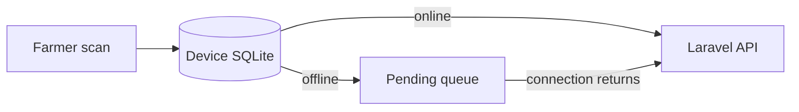

<div align="center">

# DahonMD Field App

An Expo React Native application for farmer screening, offline history, and reliable synchronization on iOS and Android.

</div>

## Start Here

Use this folder when your task involves the farmer phone app, camera/gallery flow, offline history, synchronization, or Android/iOS builds.

Before starting, install Node.js and one of these options:

- Expo Go on a physical phone; or
- Android Studio with an Android emulator.

The Laravel API must also be running with `--host=0.0.0.0`.

## What Works

- Farmer registration, login, profile, password management, and secure session restoration
- Camera and gallery selection with a clear image preview
- Plain-language result states and per-farmer SQLite history
- Offline screening flow and queued synchronization
- Connection and synchronization status with manual retry
- Exponential retry delays for temporary failures
- Optional online baseline-versus-enhanced research comparison

Authentication, disease data, and synchronization all use the authoritative Laravel API in `../backend`.

## Quick Start

### 1. Open the mobile folder

```powershell
cd mobile-frontend
```

### 2. Install packages

```powershell
npm install
```

### 3. Create local settings

```powershell
if (-not (Test-Path .env)) { Copy-Item .env.example .env }
```

### 4. Start Expo

```powershell
npm start
```

Press `a` for Android, `i` for the iOS simulator on macOS, or scan the QR code with Expo Go.

You know it worked when the DahonMD sign-in screen opens on the device or emulator.

For later runs, use only:

```powershell
cd mobile-frontend
npm start
```

## Connect to the API

| Device | `EXPO_PUBLIC_API_URL` |
| --- | --- |
| Android emulator | `http://10.0.2.2:8001/api` |
| Physical phone | `http://<computer-lan-ip>:8001/api` |

For a physical phone:

1. Connect the phone and computer to the same Wi-Fi network.
2. Run `ipconfig` and find the computer's IPv4 address.
3. Put that address in `mobile-frontend/.env`.
4. Restart Expo and reopen the app.

## Offline and Sync Behavior



Pending records retry after 2, 4, 8, 16, and at most 30 seconds. Validation and authentication failures wait for manual action instead of retrying forever. The UUID supplied by the client prevents duplicate server diagnoses when a request is repeated.

History photos are stored separately from the temporary picker cache. The history copy is limited to a 1600-pixel longest edge and encoded as JPEG at 82% quality. Analysis uses the original selected image, so history compression does not alter model input.

## Model Input Contract

Field images may be PNG, JPG/JPEG, or WEBP. The model classifies decoded pixels, not the extension.

The final native TFLite bridge must:

1. Apply physical or EXIF orientation consistently.
2. Decode to three-channel RGB.
3. Resize to `224 × 224` using the evaluated interpolation policy.
4. Represent pre-quantized input in `[0, 1]`.
5. Quantize with the TFLite tensor's real scale and zero point.
6. Dequantize outputs when needed, apply softmax once, and use the paired `label_map.json`.

Never hard-code another class order in TypeScript. Bundle the validated model and label map together, record their versions and checksums, and reject an inconsistent pair.

> [!CAUTION]
> `src/services/inference.ts` is still a safe simulated placeholder. Camera access and image preview do not mean production model inference is active.

## Research Comparison

When the device is online and the optional service is configured, the original selected photo may also be sent to `/api/research/model-comparison`.

The result screen labels this as thesis research. It is unavailable offline, does not replace the normal screening result, and is never stored in SQLite or synchronized into diagnosis history.

## Development Checks

```powershell
npm test
npm run typecheck
npm run release:status
```

| Command | Purpose |
| --- | --- |
| `npm test` | Run automated behavior tests |
| `npm run typecheck` | Find TypeScript mistakes without building the app |
| `npm run release:status` | Explain which production-release requirements remain |

## Common Problems

| Problem | What to do |
| --- | --- |
| `npm` is not recognized | Install Node.js, reopen PowerShell, and check `npm --version`. |
| Expo cannot find the project | Confirm the terminal is inside `mobile-frontend`. |
| Android emulator cannot reach the API | Use `http://10.0.2.2:8001/api`. |
| Physical phone cannot reach the API | Use the computer's LAN IP and the same Wi-Fi network. |
| An `.env` change is ignored | Stop Expo, run `npm start`, and reopen the app. |
| Camera permission is denied | Enable camera/photo permission in device settings and retry. |
| Offline records do not sync | Restore connectivity, confirm the API is running, and use manual retry. |
| Tests fail after a UI change | Read the first failure, update the behavior or its test, and rerun `npm test`. |

## Android Builds

| Command | Purpose |
| --- | --- |
| `npm run build:android:preview` | Create an internal-testing APK with EAS |
| `npm run build:android:production` | Run release checks and create a Play Store AAB |

Production remains blocked while simulated inference or local-only services are configured. A preview build also needs a reachable HTTPS deployment of the Laravel API.

See [PLAY_STORE_RELEASE.md](./PLAY_STORE_RELEASE.md) for EAS setup, store preparation, testing tracks, listing copy, and dataset-dependent release gates.

## Before Thesis Evaluation

- Test genuine captures from every supported target phone.
- Report cold-start and warmed inference latency, model size, and memory use.
- Report overall and per-class accuracy with support counts.
- Where sample size permits, analyze device, format, lighting, and image-quality subgroups.
- Preserve model version and simulation state when offline records synchronize.

## Safe Student Workflow

1. Start the API and Expo.
2. Confirm login while online.
3. Test the feature on the intended device or emulator.
4. Turn connectivity off and verify the offline state when relevant.
5. Restore connectivity and confirm pending records synchronize only once.
6. Run the three development checks before handing off the change.

Return to the [main project guide](../README.md) or read the [AI pipeline guide](../ai/README.md).
